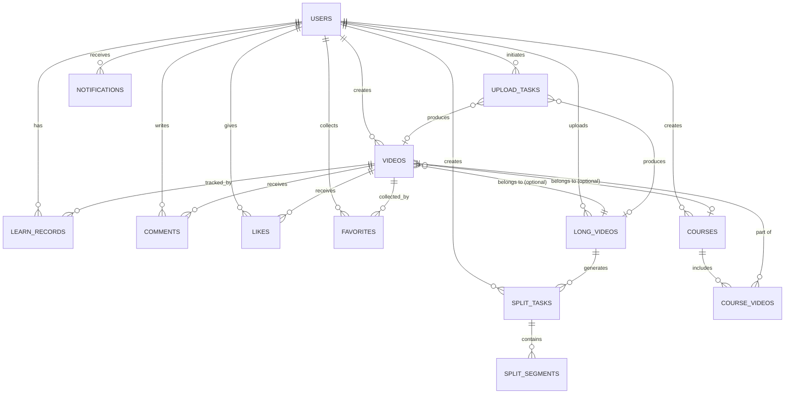

# 短视频学习平台 - 数据库设计文档
---

## 一、数据库概述

### 1.1 数据库选型
- **主数据库**：PostgreSQL 14+
- **缓存数据库**：Redis 6+
- **对象存储**：S3兼容存储:MinIO

### 1.2 命名规范
- **表名**：小写字母，单词间用下划线分隔，复数形式（如：`users`, `videos`）
- **字段名**：小写字母，单词间用下划线分隔（如：`user_id`, `created_at`）
- **主键**：统一使用`id`，类型为`UUID`或`BIGSERIAL`
- **外键**：`关联表名_id`格式（如：`user_id`, `video_id`）
- **索引**：`idx_表名_字段名`格式（如：`idx_videos_author_id`）

### 1.3 字段类型说明
- **UUID**：使用PostgreSQL的UUID类型，默认生成`uuid_generate_v4()`
- **时间戳**：使用`TIMESTAMP WITH TIME ZONE`，统一存储UTC时间
- **JSON**：使用`JSONB`类型存储结构化数据
- **枚举**：使用`ENUM`类型或`VARCHAR`配合CHECK约束

---

## 二、核心实体关系图（ER图）



---

## 三、表结构

### 3.1 用户表（users）

| 字段名 | 类型 | 约束 | 说明 |
|--------|------|------|------|
| id | UUID | PK | 用户ID |
| phone | VARCHAR(20) | UNIQUE, NOT NULL | 手机号 |
| nickname | VARCHAR(50) | NOT NULL | 昵称 |
| avatar_url | VARCHAR(500) | | 头像URL |
| bio | TEXT | | 个人简介 |
| language | VARCHAR(10) | DEFAULT 'zh-CN' | 语言偏好 |
| roles | VARCHAR(50)[] | DEFAULT '{learner}' | 角色数组：learner/creator/admin |
| created_at | TIMESTAMP WITH TIME ZONE | DEFAULT NOW() | 创建时间 |
| updated_at | TIMESTAMP WITH TIME ZONE | DEFAULT NOW() | 更新时间 |

**索引**：
- `idx_users_phone` ON `phone`
- `idx_users_created_at` ON `created_at`

---

### 3.2 视频表（videos）

| 字段名 | 类型 | 约束 | 说明 |
|--------|------|------|------|
| id | UUID | PK | 视频ID |
| author_id | UUID | FK→users.id, NOT NULL | 作者ID |
| title | VARCHAR(200) | NOT NULL | 标题 |
| description | TEXT | | 描述 |
| tags | VARCHAR(50)[] | | 标签数组 |
| duration | INTEGER | NOT NULL | 时长（秒） |
| play_url | VARCHAR(500) | NOT NULL | 播放地址（HLS） |
| cover_url | VARCHAR(500) | | 封面URL |
| language | VARCHAR(10) | DEFAULT 'zh-CN' | 语言 |
| status | VARCHAR(20) | NOT NULL, DEFAULT 'pending' | 状态：pending/online/rejected |
| reject_reason | TEXT | | 驳回原因 |
| created_at | TIMESTAMP WITH TIME ZONE | DEFAULT NOW() | 创建时间 |
| updated_at | TIMESTAMP WITH TIME ZONE | DEFAULT NOW() | 更新时间 |

**扩展字段**（新增）：
| 字段名 | 类型 | 约束 | 说明 |
|--------|------|------|------|
| parent_video_id | UUID | FK→long_videos.id | 关联的长视频ID（如果是拆分出的短视频） |
| course_id | UUID | FK→courses.id | 所属课程ID（如果属于课程） |
| segment_index | INTEGER | | 在课程中的序号（从0开始） |
| video_type | VARCHAR(20) | DEFAULT 'short' | 视频类型：short/long |

**索引**：
- `idx_videos_author_id` ON `author_id`
- `idx_videos_status` ON `status`
- `idx_videos_created_at` ON `created_at`
- `idx_videos_tags` ON `tags` (GIN索引)
- `idx_videos_parent_video_id` ON `parent_video_id` (新增)
- `idx_videos_course_id` ON `course_id` (新增)

---

### 3.3 学习记录表（learn_records）

| 字段名 | 类型 | 约束 | 说明 |
|--------|------|------|------|
| id | UUID | PK | 记录ID |
| user_id | UUID | FK→users.id, NOT NULL | 用户ID |
| video_id | UUID | FK→videos.id, NOT NULL | 视频ID |
| last_position | INTEGER | DEFAULT 0 | 最后观看位置（秒） |
| completed_ratio | DECIMAL(5,2) | DEFAULT 0.00 | 完成度（0-100） |
| status | VARCHAR(20) | DEFAULT 'not_started' | 状态：not_started/learned/review_needed |
| last_watch_time | TIMESTAMP WITH TIME ZONE | | 最后观看时间 |
| created_at | TIMESTAMP WITH TIME ZONE | DEFAULT NOW() | 创建时间 |
| updated_at | TIMESTAMP WITH TIME ZONE | DEFAULT NOW() | 更新时间 |

**索引**：
- `idx_learn_records_user_id` ON `user_id`
- `idx_learn_records_video_id` ON `video_id`
- `UNIQUE (user_id, video_id)`

---

### 3.4 评论表（comments）

| 字段名 | 类型 | 约束 | 说明 |
|--------|------|------|------|
| id | UUID | PK | 评论ID |
| video_id | UUID | FK→videos.id, NOT NULL | 视频ID |
| user_id | UUID | FK→users.id, NOT NULL | 用户ID |
| parent_id | UUID | FK→comments.id | 父评论ID（楼中楼） |
| content | TEXT | NOT NULL | 评论内容 |
| like_count | INTEGER | DEFAULT 0 | 点赞数 |
| created_at | TIMESTAMP WITH TIME ZONE | DEFAULT NOW() | 创建时间 |
| updated_at | TIMESTAMP WITH TIME ZONE | DEFAULT NOW() | 更新时间 |

**索引**：
- `idx_comments_video_id` ON `video_id`
- `idx_comments_user_id` ON `user_id`
- `idx_comments_parent_id` ON `parent_id`

---

### 3.5 点赞表（likes）

| 字段名 | 类型 | 约束 | 说明 |
|--------|------|------|------|
| id | UUID | PK | 点赞ID |
| video_id | UUID | FK→videos.id, NOT NULL | 视频ID |
| user_id | UUID | FK→users.id, NOT NULL | 用户ID |
| created_at | TIMESTAMP WITH TIME ZONE | DEFAULT NOW() | 创建时间 |

**索引**：
- `idx_likes_video_id` ON `video_id`
- `idx_likes_user_id` ON `user_id`
- `UNIQUE (video_id, user_id)`

---

### 3.6 收藏表（favorites）

| 字段名 | 类型 | 约束 | 说明 |
|--------|------|------|------|
| id | UUID | PK | 收藏ID |
| video_id | UUID | FK→videos.id, NOT NULL | 视频ID |
| user_id | UUID | FK→users.id, NOT NULL | 用户ID |
| created_at | TIMESTAMP WITH TIME ZONE | DEFAULT NOW() | 创建时间 |

**索引**：
- `idx_favorites_video_id` ON `video_id`
- `idx_favorites_user_id` ON `user_id`
- `UNIQUE (video_id, user_id)`

---

### 3.7 上传任务表（upload_tasks）

| 字段名 | 类型 | 约束 | 说明 |
|--------|------|------|------|
| id | UUID | PK | 任务ID |
| upload_id | VARCHAR(100) | UNIQUE, NOT NULL | 上传任务ID（业务ID） |
| user_id | UUID | FK→users.id, NOT NULL | 用户ID |
| file_name | VARCHAR(500) | NOT NULL | 文件名 |
| file_size | BIGINT | NOT NULL | 文件大小（字节） |
| duration | INTEGER | | 视频时长（秒） |
| status | VARCHAR(20) | NOT NULL, DEFAULT 'uploading' | 状态：uploading/uploaded/transcoding/finished/failed |
| completed_chunks | INTEGER[] | | 已完成分片索引数组 |
| created_at | TIMESTAMP WITH TIME ZONE | DEFAULT NOW() | 创建时间 |
| updated_at | TIMESTAMP WITH TIME ZONE | DEFAULT NOW() | 更新时间 |

**扩展字段**（新增）：
| 字段名 | 类型 | 约束 | 说明 |
|--------|------|------|------|
| video_type | VARCHAR(20) | DEFAULT 'short' | 视频类型：short/long |

**索引**：
- `idx_upload_tasks_user_id` ON `user_id`
- `idx_upload_tasks_status` ON `status`
- `idx_upload_tasks_upload_id` ON `upload_id`

---

### 3.8 通知表（notifications）

| 字段名 | 类型 | 约束 | 说明 |
|--------|------|------|------|
| id | UUID | PK | 通知ID |
| user_id | UUID | FK→users.id, NOT NULL | 用户ID |
| type | VARCHAR(50) | NOT NULL | 类型：comment_reply/audit_result/system/split_completed |
| title | VARCHAR(200) | NOT NULL | 标题 |
| content | TEXT | NOT NULL | 内容 |
| related_id | VARCHAR(100) | | 关联ID（如拆分任务ID、视频ID等） |
| is_read | BOOLEAN | DEFAULT FALSE | 是否已读 |
| created_at | TIMESTAMP WITH TIME ZONE | DEFAULT NOW() | 创建时间 |

**索引**：
- `idx_notifications_user_id` ON `user_id`
- `idx_notifications_is_read` ON `is_read`
- `idx_notifications_created_at` ON `created_at`

---


### 3.9 长视频表（long_videos）

**表说明**：存储长视频的基本信息，关联到videos表

| 字段名 | 类型 | 约束 | 说明 |
|--------|------|------|------|
| id | UUID | PK | 长视频ID |
| video_id | UUID | FK→videos.id, UNIQUE, NOT NULL | 关联的视频ID（videos表中video_type='long'的记录） |
| original_duration | INTEGER | NOT NULL | 原始时长（秒） |
| original_file_url | VARCHAR(500) | NOT NULL | 原始文件URL |
| split_enabled | BOOLEAN | DEFAULT TRUE | 是否允许拆分 |
| created_at | TIMESTAMP WITH TIME ZONE | DEFAULT NOW() | 创建时间 |
| updated_at | TIMESTAMP WITH TIME ZONE | DEFAULT NOW() | 更新时间 |

**索引**：
- `idx_long_videos_video_id` ON `video_id`
- `idx_long_videos_created_at` ON `created_at`

**SQL创建语句**：
```sql
CREATE TABLE long_videos (
    id UUID PRIMARY KEY DEFAULT uuid_generate_v4(),
    video_id UUID NOT NULL UNIQUE REFERENCES videos(id) ON DELETE CASCADE,
    original_duration INTEGER NOT NULL,
    original_file_url VARCHAR(500) NOT NULL,
    split_enabled BOOLEAN DEFAULT TRUE,
    created_at TIMESTAMP WITH TIME ZONE DEFAULT NOW(),
    updated_at TIMESTAMP WITH TIME ZONE DEFAULT NOW()
);

CREATE INDEX idx_long_videos_video_id ON long_videos(video_id);
CREATE INDEX idx_long_videos_created_at ON long_videos(created_at);
```

---

### 3.10 拆分任务表（split_tasks）

**表说明**：记录视频拆分任务的配置和状态

| 字段名 | 类型 | 约束 | 说明 |
|--------|------|------|------|
| id | UUID | PK | 任务ID |
| task_id | VARCHAR(100) | UNIQUE, NOT NULL | 任务业务ID |
| long_video_id | UUID | FK→long_videos.id, NOT NULL | 长视频ID |
| user_id | UUID | FK→users.id, NOT NULL | 创建用户ID |
| split_mode | VARCHAR(20) | NOT NULL | 拆分模式：auto/manual/hybrid |
| auto_config | JSONB | | 自动拆分配置（JSON格式） |
| organization_mode | VARCHAR(20) | NOT NULL | 组织模式：course/independent/both |
| status | VARCHAR(20) | NOT NULL, DEFAULT 'pending' | 状态：pending/processing/completed/failed/cancelled |
| progress | DECIMAL(5,2) | DEFAULT 0.00 | 处理进度（0-100） |
| error_message | TEXT | | 错误信息（失败时） |
| created_at | TIMESTAMP WITH TIME ZONE | DEFAULT NOW() | 创建时间 |
| updated_at | TIMESTAMP WITH TIME ZONE | DEFAULT NOW() | 更新时间 |
| completed_at | TIMESTAMP WITH TIME ZONE | | 完成时间 |

**索引**：
- `idx_split_tasks_long_video_id` ON `long_video_id`
- `idx_split_tasks_user_id` ON `user_id`
- `idx_split_tasks_status` ON `status`
- `idx_split_tasks_task_id` ON `task_id`
- `idx_split_tasks_created_at` ON `created_at`

**SQL创建语句**：
```sql
CREATE TABLE split_tasks (
    id UUID PRIMARY KEY DEFAULT uuid_generate_v4(),
    task_id VARCHAR(100) NOT NULL UNIQUE,
    long_video_id UUID NOT NULL REFERENCES long_videos(id) ON DELETE CASCADE,
    user_id UUID NOT NULL REFERENCES users(id) ON DELETE CASCADE,
    split_mode VARCHAR(20) NOT NULL CHECK (split_mode IN ('auto', 'manual', 'hybrid')),
    auto_config JSONB,
    organization_mode VARCHAR(20) NOT NULL CHECK (organization_mode IN ('course', 'independent', 'both')),
    status VARCHAR(20) NOT NULL DEFAULT 'pending' CHECK (status IN ('pending', 'processing', 'completed', 'failed', 'cancelled')),
    progress DECIMAL(5,2) DEFAULT 0.00 CHECK (progress >= 0 AND progress <= 100),
    error_message TEXT,
    created_at TIMESTAMP WITH TIME ZONE DEFAULT NOW(),
    updated_at TIMESTAMP WITH TIME ZONE DEFAULT NOW(),
    completed_at TIMESTAMP WITH TIME ZONE
);

CREATE INDEX idx_split_tasks_long_video_id ON split_tasks(long_video_id);
CREATE INDEX idx_split_tasks_user_id ON split_tasks(user_id);
CREATE INDEX idx_split_tasks_status ON split_tasks(status);
CREATE INDEX idx_split_tasks_task_id ON split_tasks(task_id);
CREATE INDEX idx_split_tasks_created_at ON split_tasks(created_at);
```

**auto_config JSONB结构示例**：
```json
{
  "method": "scene_detection",  // scene_detection/fixed_duration
  "min_segment_duration": 60,
  "max_segment_duration": 180,
  "fixed_duration": null  // method为fixed_duration时使用
}
```

---

### 3.11 拆分片段表（split_segments）

**表说明**：记录拆分任务中的每个片段信息

| 字段名 | 类型 | 约束 | 说明 |
|--------|------|------|------|
| id | UUID | PK | 片段ID |
| task_id | UUID | FK→split_tasks.id, NOT NULL | 拆分任务ID |
| segment_index | INTEGER | NOT NULL | 片段序号（从0开始） |
| start_time | INTEGER | NOT NULL | 开始时间（秒） |
| end_time | INTEGER | NOT NULL | 结束时间（秒） |
| duration | INTEGER | NOT NULL | 片段时长（秒） |
| thumbnail_url | VARCHAR(500) | | 缩略图URL |
| scene_type | VARCHAR(50) | | 拆分原因：scene_change/audio_silence/fixed_duration/manual |
| confidence | DECIMAL(5,2) | | 置信度（0-1，自动拆分时） |
| video_id | UUID | FK→videos.id | 生成的视频ID（拆分完成后） |
| created_at | TIMESTAMP WITH TIME ZONE | DEFAULT NOW() | 创建时间 |
| updated_at | TIMESTAMP WITH TIME ZONE | DEFAULT NOW() | 更新时间 |

**索引**：
- `idx_split_segments_task_id` ON `task_id`
- `idx_split_segments_video_id` ON `video_id`
- `UNIQUE (task_id, segment_index)`

**SQL创建语句**：
```sql
CREATE TABLE split_segments (
    id UUID PRIMARY KEY DEFAULT uuid_generate_v4(),
    task_id UUID NOT NULL REFERENCES split_tasks(id) ON DELETE CASCADE,
    segment_index INTEGER NOT NULL,
    start_time INTEGER NOT NULL CHECK (start_time >= 0),
    end_time INTEGER NOT NULL CHECK (end_time > start_time),
    duration INTEGER NOT NULL CHECK (duration > 0),
    thumbnail_url VARCHAR(500),
    scene_type VARCHAR(50) CHECK (scene_type IN ('scene_change', 'audio_silence', 'fixed_duration', 'manual')),
    confidence DECIMAL(5,2) CHECK (confidence >= 0 AND confidence <= 1),
    video_id UUID REFERENCES videos(id) ON DELETE SET NULL,
    created_at TIMESTAMP WITH TIME ZONE DEFAULT NOW(),
    updated_at TIMESTAMP WITH TIME ZONE DEFAULT NOW(),
    UNIQUE (task_id, segment_index)
);

CREATE INDEX idx_split_segments_task_id ON split_segments(task_id);
CREATE INDEX idx_split_segments_video_id ON split_segments(video_id);
```

---

### 3.12 课程表（courses）

**表说明**：存储课程/系列信息

| 字段名 | 类型 | 约束 | 说明 |
|--------|------|------|------|
| id | UUID | PK | 课程ID |
| course_id | VARCHAR(100) | UNIQUE, NOT NULL | 课程业务ID |
| author_id | UUID | FK→users.id, NOT NULL | 创建者ID |
| title | VARCHAR(200) | NOT NULL | 课程标题 |
| description | TEXT | | 课程描述 |
| tags | VARCHAR(50)[] | | 标签数组 |
| language | VARCHAR(10) | DEFAULT 'zh-CN' | 语言 |
| cover_url | VARCHAR(500) | | 封面URL |
| status | VARCHAR(20) | NOT NULL, DEFAULT 'draft' | 状态：draft/pending/online/rejected |
| reject_reason | TEXT | | 驳回原因（如果被驳回） |
| total_videos | INTEGER | DEFAULT 0 | 视频总数 |
| total_duration | INTEGER | DEFAULT 0 | 总时长（秒） |
| created_at | TIMESTAMP WITH TIME ZONE | DEFAULT NOW() | 创建时间 |
| updated_at | TIMESTAMP WITH TIME ZONE | DEFAULT NOW() | 更新时间 |

**索引**：
- `idx_courses_author_id` ON `author_id`
- `idx_courses_status` ON `status`
- `idx_courses_course_id` ON `course_id`
- `idx_courses_tags` ON `tags` (GIN索引)
- `idx_courses_created_at` ON `created_at`

**SQL创建语句**：
```sql
CREATE TABLE courses (
    id UUID PRIMARY KEY DEFAULT uuid_generate_v4(),
    course_id VARCHAR(100) NOT NULL UNIQUE,
    author_id UUID NOT NULL REFERENCES users(id) ON DELETE CASCADE,
    title VARCHAR(200) NOT NULL,
    description TEXT,
    tags VARCHAR(50)[],
    language VARCHAR(10) DEFAULT 'zh-CN',
    cover_url VARCHAR(500),
    status VARCHAR(20) NOT NULL DEFAULT 'draft' CHECK (status IN ('draft', 'pending', 'online', 'rejected')),
    reject_reason TEXT,
    total_videos INTEGER DEFAULT 0 CHECK (total_videos >= 0),
    total_duration INTEGER DEFAULT 0 CHECK (total_duration >= 0),
    created_at TIMESTAMP WITH TIME ZONE DEFAULT NOW(),
    updated_at TIMESTAMP WITH TIME ZONE DEFAULT NOW()
);

CREATE INDEX idx_courses_author_id ON courses(author_id);
CREATE INDEX idx_courses_status ON courses(status);
CREATE INDEX idx_courses_course_id ON courses(course_id);
CREATE INDEX idx_courses_tags ON courses USING GIN(tags);
CREATE INDEX idx_courses_created_at ON courses(created_at);
```

---

### 3.13 课程视频关联表（course_videos）

**表说明**：课程与视频的多对多关系表，记录视频在课程中的顺序

| 字段名 | 类型 | 约束 | 说明 |
|--------|------|------|------|
| id | UUID | PK | 关联ID |
| course_id | UUID | FK→courses.id, NOT NULL | 课程ID |
| video_id | UUID | FK→videos.id, NOT NULL | 视频ID |
| segment_index | INTEGER | NOT NULL | 在课程中的序号（从0开始） |
| created_at | TIMESTAMP WITH TIME ZONE | DEFAULT NOW() | 创建时间 |

**索引**：
- `idx_course_videos_course_id` ON `course_id`
- `idx_course_videos_video_id` ON `video_id`
- `UNIQUE (course_id, segment_index)`
- `UNIQUE (course_id, video_id)`

**SQL创建语句**：
```sql
CREATE TABLE course_videos (
    id UUID PRIMARY KEY DEFAULT uuid_generate_v4(),
    course_id UUID NOT NULL REFERENCES courses(id) ON DELETE CASCADE,
    video_id UUID NOT NULL REFERENCES videos(id) ON DELETE CASCADE,
    segment_index INTEGER NOT NULL CHECK (segment_index >= 0),
    created_at TIMESTAMP WITH TIME ZONE DEFAULT NOW(),
    UNIQUE (course_id, segment_index),
    UNIQUE (course_id, video_id)
);

CREATE INDEX idx_course_videos_course_id ON course_videos(course_id);
CREATE INDEX idx_course_videos_video_id ON course_videos(video_id);
```

---

## 四、现有表扩展SQL

### 4.1 扩展videos表

```sql
-- 添加新字段
ALTER TABLE videos 
ADD COLUMN parent_video_id UUID REFERENCES long_videos(id) ON DELETE SET NULL,
ADD COLUMN course_id UUID REFERENCES courses(id) ON DELETE SET NULL,
ADD COLUMN segment_index INTEGER,
ADD COLUMN video_type VARCHAR(20) DEFAULT 'short' CHECK (video_type IN ('short', 'long'));

-- 添加索引
CREATE INDEX idx_videos_parent_video_id ON videos(parent_video_id);
CREATE INDEX idx_videos_course_id ON videos(course_id);
CREATE INDEX idx_videos_video_type ON videos(video_type);
```

### 4.2 扩展upload_tasks表

```sql
-- 添加新字段
ALTER TABLE upload_tasks 
ADD COLUMN video_type VARCHAR(20) DEFAULT 'short' CHECK (video_type IN ('short', 'long'));
```

---

## 五、数据字典

### 5.1 视频状态（videos.status）

| 值 | 说明 |
|----|------|
| pending | 待审核 |
| online | 已上线 |
| rejected | 审核驳回 |

### 5.2 视频类型（videos.video_type, upload_tasks.video_type）

| 值 | 说明 |
|----|------|
| short | 短视频（≤3分钟） |
| long | 长视频（>3分钟） |

### 5.3 拆分模式（split_tasks.split_mode）

| 值 | 说明 |
|----|------|
| auto | 自动拆分 |
| manual | 手动拆分 |
| hybrid | 混合模式（自动+手动调整） |

### 5.4 组织模式（split_tasks.organization_mode）

| 值 | 说明 |
|----|------|
| course | 组织成课程/系列 |
| independent | 独立视频 |
| both | 两种模式 |

### 5.5 拆分任务状态（split_tasks.status）

| 值 | 说明 |
|----|------|
| pending | 待处理 |
| processing | 处理中 |
| completed | 已完成 |
| failed | 失败 |
| cancelled | 已取消 |

### 5.6 场景类型（split_segments.scene_type）

| 值 | 说明 |
|----|------|
| scene_change | 场景切换 |
| audio_silence | 音频静音 |
| fixed_duration | 固定时长 |
| manual | 手动标记 |

### 5.7 课程状态（courses.status）

| 值 | 说明 |
|----|------|
| draft | 草稿 |
| pending | 待审核 |
| online | 已上线 |
| rejected | 审核驳回 |

### 5.8 学习记录状态（learn_records.status）

| 值 | 说明 |
|----|------|
| not_started | 从未观看 |
| learned | 已学完成 |
| review_needed | 需复习 |

### 5.9 上传任务状态（upload_tasks.status）

| 值 | 说明 |
|----|------|
| uploading | 上传中 |
| uploaded | 已上传 |
| transcoding | 转码中 |
| finished | 已完成 |
| failed | 失败 |

### 5.10 通知类型（notifications.type）

| 值 | 说明 |
|----|------|
| comment_reply | 评论回复 |
| audit_result | 审核结果 |
| system | 系统通知 |
| split_completed | 拆分完成 |

---

## 六、触发器设计

### 6.1 自动更新updated_at字段

```sql
-- 创建更新updated_at的函数
CREATE OR REPLACE FUNCTION update_updated_at_column()
RETURNS TRIGGER AS $$
BEGIN
    NEW.updated_at = NOW();
    RETURN NEW;
END;
$$ LANGUAGE plpgsql;

-- 为所有表添加触发器
CREATE TRIGGER update_users_updated_at BEFORE UPDATE ON users
    FOR EACH ROW EXECUTE FUNCTION update_updated_at_column();

CREATE TRIGGER update_videos_updated_at BEFORE UPDATE ON videos
    FOR EACH ROW EXECUTE FUNCTION update_updated_at_column();

CREATE TRIGGER update_courses_updated_at BEFORE UPDATE ON courses
    FOR EACH ROW EXECUTE FUNCTION update_updated_at_column();

CREATE TRIGGER update_split_tasks_updated_at BEFORE UPDATE ON split_tasks
    FOR EACH ROW EXECUTE FUNCTION update_updated_at_column();

-- ... 其他表类似
```

### 6.2 自动更新课程统计信息

```sql
-- 创建更新课程统计信息的函数
CREATE OR REPLACE FUNCTION update_course_stats()
RETURNS TRIGGER AS $$
BEGIN
    IF TG_OP = 'INSERT' THEN
        UPDATE courses 
        SET total_videos = total_videos + 1,
            total_duration = total_duration + (SELECT duration FROM videos WHERE id = NEW.video_id)
        WHERE id = NEW.course_id;
        RETURN NEW;
    ELSIF TG_OP = 'DELETE' THEN
        UPDATE courses 
        SET total_videos = total_videos - 1,
            total_duration = total_duration - (SELECT duration FROM videos WHERE id = OLD.video_id)
        WHERE id = OLD.course_id;
        RETURN OLD;
    END IF;
    RETURN NULL;
END;
$$ LANGUAGE plpgsql;

-- 添加触发器
CREATE TRIGGER update_course_stats_trigger
    AFTER INSERT OR DELETE ON course_videos
    FOR EACH ROW EXECUTE FUNCTION update_course_stats();
```

---

## 七、视图设计

### 7.1 视频详情视图（包含课程信息）

```sql
CREATE OR REPLACE VIEW video_details AS
SELECT 
    v.id,
    v.title,
    v.duration,
    v.status,
    v.video_type,
    v.parent_video_id,
    v.course_id,
    v.segment_index,
    c.title AS course_title,
    c.total_videos AS course_total_videos,
    u.nickname AS author_nickname,
    u.avatar_url AS author_avatar
FROM videos v
LEFT JOIN courses c ON v.course_id = c.id
LEFT JOIN users u ON v.author_id = u.id;
```

### 7.2 拆分任务详情视图

```sql
CREATE OR REPLACE VIEW split_task_details AS
SELECT 
    st.id,
    st.task_id,
    st.status,
    st.progress,
    st.split_mode,
    st.organization_mode,
    lv.video_id AS long_video_id,
    v.title AS long_video_title,
    COUNT(ss.id) AS total_segments,
    COUNT(CASE WHEN ss.video_id IS NOT NULL THEN 1 END) AS completed_segments
FROM split_tasks st
JOIN long_videos lv ON st.long_video_id = lv.id
JOIN videos v ON lv.video_id = v.id
LEFT JOIN split_segments ss ON st.id = ss.task_id
GROUP BY st.id, st.task_id, st.status, st.progress, st.split_mode, st.organization_mode, lv.video_id, v.title;
```

---

## 八、数据完整性约束

### 8.1 外键约束

- `videos.parent_video_id` → `long_videos.id`：级联删除时设置为NULL
- `videos.course_id` → `courses.id`：级联删除时设置为NULL
- `split_tasks.long_video_id` → `long_videos.id`：级联删除
- `split_segments.task_id` → `split_tasks.id`：级联删除
- `split_segments.video_id` → `videos.id`：删除时设置为NULL
- `course_videos.course_id` → `courses.id`：级联删除
- `course_videos.video_id` → `videos.id`：级联删除

### 8.2 业务约束

1. **视频类型约束**：
   - `videos.video_type = 'long'`时，必须存在对应的`long_videos`记录
   - `videos.video_type = 'short'`且`parent_video_id`不为NULL时，表示是拆分出的短视频

2. **课程约束**：
   - 视频属于课程时，`course_id`和`segment_index`必须同时设置
   - `course_videos`表中的`segment_index`必须连续且从0开始

3. **拆分任务约束**：
   - 拆分任务完成后，`split_segments`中的`video_id`必须全部设置
   - `split_segments`中的时间范围不能重叠

---

## 九、索引优化建议

### 9.1 复合索引

```sql
-- 查询用户创建的拆分任务（按状态和时间排序）
CREATE INDEX idx_split_tasks_user_status_created ON split_tasks(user_id, status, created_at DESC);

-- 查询课程中的视频（按序号排序）
CREATE INDEX idx_course_videos_course_segment ON course_videos(course_id, segment_index);

-- 查询长视频的拆分任务
CREATE INDEX idx_split_tasks_long_video_status ON split_tasks(long_video_id, status);
```

### 9.2 部分索引

```sql
-- 只索引在线状态的视频
CREATE INDEX idx_videos_status_online ON videos(status) WHERE status = 'online';

-- 只索引已完成的拆分任务
CREATE INDEX idx_split_tasks_completed ON split_tasks(completed_at) WHERE status = 'completed';
```

---


## 十、性能优化建议

1. **分区表**：对于`videos`、`learn_records`等大表，可按时间分区
2. **读写分离**：使用PostgreSQL主从复制，读操作使用从库
3. **缓存策略**：使用Redis缓存热点数据（如视频详情、课程信息）
4. **归档策略**：定期归档历史数据（如已删除的视频、过期的通知）

---


