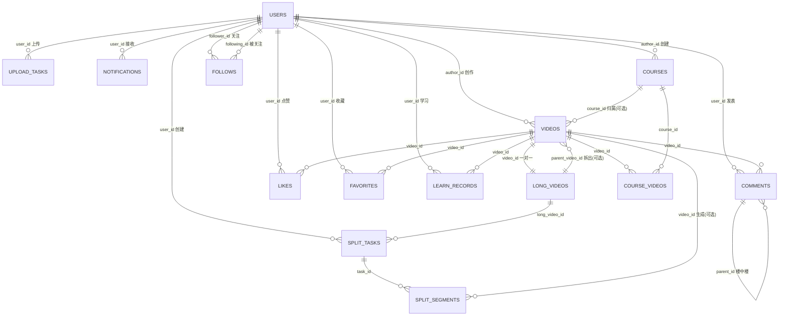

# 短视频学习平台 - 数据库设计文档

本文档以 `backend/common/models/` 下的 SQLAlchemy 模型与 `backend/alembic/` 迁移脚本为唯一事实源，逐表、逐字段、逐索引核对生成。表结构、类型、约束、索引与关系均反映当前代码实现。

---

## 一、数据库概述

### 1.1 组件选型

| 组件 | 选型 | 来源 |
| ------ | ------ | ------ |
| 主数据库 | PostgreSQL 14 | `docker-compose.yml`（`postgres:14`，端口 5432）；`connection.py` 仅接受 `postgresql://` 或 `postgresql+psycopg` 连接串 |
| 缓存 | Redis | `docker-compose.yml`（`redis:7-alpine`，端口 6379）；`connection.py` 的 `get_redis()` |
| 异步任务 | Celery + Redis（split-worker）、Kafka | `services/split/app/celery_app.py`、`docker-compose.yml` |
| 文件存储 | 默认本地磁盘，可切换 S3 兼容对象存储 | `services/upload/app/services/storage.py`（`STORAGE_TYPE` 默认 `local`，`S3` 分支走 MinIO/AWS） |

引擎与方言说明：`connection.py` 在导入时校验连接串前缀，仅支持 PostgreSQL，遇到非 `postgresql` 前缀直接抛 `ValueError`；ORM 层不使用 SQLite。`docker-compose.yml`、`requirements.txt`（`psycopg[binary]>=3.1.0`）、全部模型文件（`sqlalchemy.dialects.postgresql` 的 `UUID`、`ARRAY`、`JSONB`）三方一致，项目代码内无任何 MySQL/MariaDB/PyMySQL/3306 引用。

### 1.2 部署形态：单库共享

所有微服务（auth、content、upload、split、course、search、notification）连接同一个 PostgreSQL 数据库 `short_video_platform`（`docker-compose.yml` 中各服务的 `DATABASE_URL` 完全一致），模型集中在 `common/models/` 供全部服务共享，单库共享、不分库分表。测试库为 `short_video_platform_test`（`tests/conftest.py`）。

### 1.3 建表方式

- 基础表结构由 `init_db()` 调用 `Base.metadata.create_all(bind=engine)` 创建；每个服务的 `main.py` 在模块导入阶段直接调用 `init_db()`，应用启动即建表。
- Alembic 迁移链在 `create_all` 之上补充数据库层对象：`uuid-ossp` 扩展、`videos.tags` 与 `courses.tags` 的 GIN 索引、`updated_at` 自动更新触发器与课程统计触发器、`follows` 表、用户资料扩展字段。初始迁移的 `upgrade()` 为占位（`pass`），不生成基础表；基础表始终来自 `create_all`。
- **并发建表保护**：7 个服务在导入阶段都会调 `init_db()`，并发 `create_all` 会撞 `pg_type` 唯一索引报错。实现上先取 `pg_advisory_lock(727272)` 再建表——拿到锁的服务建表，后到者 `checkfirst` 直接跳过，锁在 `finally` 释放；演示用户同理改为「查不到才插入」的 upsert（见 `common/database/connection.py::init_db`）。

### 1.4 命名规范

- 表名：小写、下划线分隔、复数（如 `users`、`videos`、`course_videos`）。
- 字段名：小写、下划线分隔（如 `user_id`、`created_at`）。
- 主键：统一 `id`，类型 PostgreSQL `UUID`。
- 外键：`关联表名_id`（如 `author_id` 指向 `users.id`、`video_id` 指向 `videos.id`；业务命名保留 `author_id`/`user_id` 等语义别名）。
- 索引：`idx_表名_字段名`（如 `idx_videos_author_id`），复合索引拼接字段名（如 `idx_likes_video_user`）。

### 1.5 字段类型规范

| 场景 | 类型 | 落地说明 |
| ------ | ------ | ---------- |
| 主键 / 外键 | `UUID` | `sqlalchemy.dialects.postgresql.UUID(as_uuid=True)`，值由应用层 `uuid.uuid4()` 生成（列 `default=uuid.uuid4`），数据库侧无默认值 |
| 时间戳 | `TIMESTAMPTZ` | `DateTime(timezone=True)`；`created_at` 用 `server_default=func.now()`（即 `DEFAULT now()`），`updated_at` 用 ORM `onupdate=func.now()`，配合数据库触发器 |
| 数组 | `VARCHAR(50)[]` / `INTEGER[]` | PostgreSQL 原生数组，仅用于 `tags`、`roles`、`completed_chunks` |
| 结构化数据 | `JSONB` | 仅 `split_tasks.auto_config` |
| 枚举/状态 | `VARCHAR` | 全部使用 `VARCHAR`，数据库层不建 `ENUM` 类型、不建 `CHECK` 约束，取值合法性由应用层保证 |
| 金额/比率 | `NUMERIC(5,2)` | `completed_ratio`、`progress`、`confidence` |

---

## 二、核心实体关系图（ER 图）

关系全部来自各模型 `ForeignKey(...)` 声明。`upload_tasks` 与 `videos`/`long_videos` 之间无外键关联，图中不再绘制该连线。

---

## 三、表结构

以下字段、类型、约束、可空性、默认值均以模型定义为准。`默认值` 列区分两类：`server_default` 表示数据库层默认，`ORM default` 表示应用层写入时填充、数据库无默认。

### 3.1 用户表（users）

来源：`common/models/user.py`

| 字段名 | 类型 | 约束 | 默认值 | 说明 |
| -------- | ------ | ------ | -------- | ------ |
| id | UUID | PK | ORM `uuid.uuid4()` | 用户 ID |
| phone | VARCHAR(20) | UNIQUE, NOT NULL | - | 手机号 |
| nickname | VARCHAR(50) | NOT NULL | - | 昵称 |
| avatar_url | VARCHAR(500) | | - | 头像 URL |
| bio | TEXT | | - | 个人简介 |
| gender | VARCHAR(10) | | server `male` | 性别 |
| location | VARCHAR(100) | | - | 所在地 |
| school | VARCHAR(100) | | - | 学校 |
| language | VARCHAR(10) | | ORM `zh-CN` | 语言偏好 |
| roles | VARCHAR(50)[] | | ORM `['learner']` | 角色数组：learner / creator / admin |
| created_at | TIMESTAMPTZ | | server `now()` | 创建时间 |
| updated_at | TIMESTAMPTZ | | ORM onupdate | 更新时间 |

**索引**：`idx_users_phone`（`phone`）。

---

### 3.2 视频表（videos）

来源：`common/models/video.py`

| 字段名 | 类型 | 约束 | 默认值 | 说明 |
| -------- | ------ | ------ | -------- | ------ |
| id | UUID | PK | ORM `uuid.uuid4()` | 视频 ID |
| author_id | UUID | FK→users.id, NOT NULL | - | 作者 ID |
| title | VARCHAR(200) | NOT NULL | - | 标题 |
| description | TEXT | | - | 描述 |
| tags | VARCHAR(50)[] | | - | 标签数组 |
| duration | INTEGER | NOT NULL | - | 时长（秒） |
| play_url | VARCHAR(500) | NOT NULL | - | 播放地址 |
| cover_url | VARCHAR(500) | | - | 封面 URL |
| language | VARCHAR(10) | | ORM `zh-CN` | 语言 |
| status | VARCHAR(20) | NOT NULL | ORM `pending` | 状态：pending / online / published / approved / rejected（应用层取值） |
| reject_reason | TEXT | | - | 驳回原因 |
| parent_video_id | UUID | FK→long_videos.id | - | 拆分来源长视频 ID（拆分出的短视频填充） |
| course_id | UUID | FK→courses.id | - | 所属课程 ID（属于课程时填充） |
| segment_index | INTEGER | | - | 在课程中的序号 |
| video_type | VARCHAR(20) | | ORM `short` | 视频类型：short / long |
| created_at | TIMESTAMPTZ | | server `now()` | 创建时间 |
| updated_at | TIMESTAMPTZ | | ORM onupdate | 更新时间 |

外键 `author_id`、`parent_video_id`、`course_id` 均无 `ON DELETE` 子句，遵循 PostgreSQL 默认 `NO ACTION`。

**索引**：`idx_videos_author_id`（author_id）、`idx_videos_status`（status）、`idx_videos_video_type`（video_type）、`idx_videos_tags`（GIN）。

---

### 3.3 长视频表（long_videos）

来源：`common/models/video.py`。存储长视频扩展信息，与 `videos` 一对一。

| 字段名 | 类型 | 约束 | 默认值 | 说明 |
| -------- | ------ | ------ | -------- | ------ |
| id | UUID | PK | ORM `uuid.uuid4()` | 长视频 ID |
| video_id | UUID | FK→videos.id, UNIQUE, NOT NULL | - | 关联视频记录（`videos.video_type='long'`） |
| original_duration | INTEGER | NOT NULL | - | 原始时长（秒） |
| original_file_url | VARCHAR(500) | NOT NULL | - | 原始文件 URL |
| split_enabled | BOOLEAN | | ORM `True` | 是否允许拆分 |
| created_at | TIMESTAMPTZ | | server `now()` | 创建时间 |
| updated_at | TIMESTAMPTZ | | ORM onupdate | 更新时间 |

**索引**：`idx_long_videos_video_id`（video_id）。`video_id` 的 `UNIQUE` 约束保证与 `videos` 一对一。

---

### 3.4 学习记录表（learn_records）

来源：`common/models/course.py`

| 字段名 | 类型 | 约束 | 默认值 | 说明 |
| -------- | ------ | ------ | -------- | ------ |
| id | UUID | PK | ORM `uuid.uuid4()` | 记录 ID |
| user_id | UUID | FK→users.id, NOT NULL | - | 用户 ID |
| video_id | UUID | FK→videos.id, NOT NULL | - | 视频 ID |
| last_position | INTEGER | | ORM `0` | 最后观看位置（秒） |
| completed_ratio | NUMERIC(5,2) | | ORM `0.00` | 完成度（0-100） |
| status | VARCHAR(20) | | ORM `not_started` | 状态：in_progress / completed（应用写入），列默认 not_started |
| last_watch_time | TIMESTAMPTZ | | - | 最后观看时间 |
| created_at | TIMESTAMPTZ | | server `now()` | 创建时间 |
| updated_at | TIMESTAMPTZ | | ORM onupdate | 更新时间 |

**索引**：`idx_learn_records_user_video`（复合：user_id, video_id）。用户与视频的一对记录唯一性由应用层查询保证，数据库层不设 UNIQUE 约束。

---

### 3.5 评论表（comments）

来源：`common/models/interaction.py`

| 字段名 | 类型 | 约束 | 默认值 | 说明 |
| -------- | ------ | ------ | -------- | ------ |
| id | UUID | PK | ORM `uuid.uuid4()` | 评论 ID |
| video_id | UUID | FK→videos.id, NOT NULL | - | 视频 ID |
| user_id | UUID | FK→users.id, NOT NULL | - | 用户 ID |
| parent_id | UUID | FK→comments.id | - | 父评论 ID（楼中楼） |
| content | TEXT | NOT NULL | - | 评论内容 |
| like_count | INTEGER | | ORM `0` | 点赞数 |
| created_at | TIMESTAMPTZ | | server `now()` | 创建时间 |
| updated_at | TIMESTAMPTZ | | ORM onupdate | 更新时间 |

**索引**：`idx_comments_video_id`（video_id）。`user_id`、`parent_id` 未建独立索引。

---

### 3.6 点赞表（likes）

来源：`common/models/interaction.py`

| 字段名 | 类型 | 约束 | 默认值 | 说明 |
| -------- | ------ | ------ | -------- | ------ |
| id | UUID | PK | ORM `uuid.uuid4()` | 点赞 ID |
| video_id | UUID | FK→videos.id, NOT NULL | - | 视频 ID |
| user_id | UUID | FK→users.id, NOT NULL | - | 用户 ID |
| created_at | TIMESTAMPTZ | | server `now()` | 创建时间 |

**索引**：`idx_likes_video_user`（复合：video_id, user_id，非唯一）。同一用户对同一视频的点赞去重在应用层处理，数据库层不设 UNIQUE 约束。

---

### 3.7 收藏表（favorites）

来源：`common/models/interaction.py`

| 字段名 | 类型 | 约束 | 默认值 | 说明 |
| -------- | ------ | ------ | -------- | ------ |
| id | UUID | PK | ORM `uuid.uuid4()` | 收藏 ID |
| video_id | UUID | FK→videos.id, NOT NULL | - | 视频 ID |
| user_id | UUID | FK→users.id, NOT NULL | - | 用户 ID |
| created_at | TIMESTAMPTZ | | server `now()` | 创建时间 |

**索引**：`idx_favorites_video_user`（复合：video_id, user_id，非唯一）。去重同样在应用层。

---

### 3.8 关注表（follows）

来源：`common/models/interaction.py`

| 字段名 | 类型 | 约束 | 默认值 | 说明 |
| -------- | ------ | ------ | -------- | ------ |
| id | UUID | PK | ORM `uuid.uuid4()` | 关注记录 ID |
| follower_id | UUID | FK→users.id, NOT NULL | - | 关注者 ID |
| following_id | UUID | FK→users.id, NOT NULL | - | 被关注者 ID |
| created_at | TIMESTAMPTZ | | server `now()` | 创建时间 |

**索引**：`idx_follows_follower_id`（follower_id）、`idx_follows_following_id`（following_id）、`idx_follows_follower_following`（复合：follower_id, following_id，UNIQUE，保证同一关注关系唯一）。

---

### 3.9 上传任务表（upload_tasks）

来源：`common/models/upload.py`

| 字段名 | 类型 | 约束 | 默认值 | 说明 |
| -------- | ------ | ------ | -------- | ------ |
| id | UUID | PK | ORM `uuid.uuid4()` | 任务主键 |
| upload_id | VARCHAR(100) | UNIQUE, NOT NULL | - | 上传业务 ID |
| user_id | UUID | FK→users.id, NOT NULL | - | 用户 ID |
| file_name | VARCHAR(500) | NOT NULL | - | 文件名 |
| file_size | BIGINT | NOT NULL | - | 文件大小（字节） |
| duration | INTEGER | | - | 视频时长（秒） |
| status | VARCHAR(20) | NOT NULL | ORM `uploading` | 状态：initialized / uploading / uploaded / transcoding（应用写入） |
| completed_chunks | INTEGER[] | | - | 已完成分片索引数组 |
| video_type | VARCHAR(20) | | ORM `short` | 视频类型：short / long |
| created_at | TIMESTAMPTZ | | server `now()` | 创建时间 |
| updated_at | TIMESTAMPTZ | | ORM onupdate | 更新时间 |

`upload_tasks` 仅通过 `user_id` 关联用户，不指向 `videos`/`long_videos`。

**索引**：`idx_upload_tasks_user_id`（user_id）。`upload_id` 由 UNIQUE 约束自带唯一索引，`status` 未建独立索引。

---

### 3.10 通知表（notifications）

来源：`common/models/notification.py`

| 字段名 | 类型 | 约束 | 默认值 | 说明 |
| -------- | ------ | ------ | -------- | ------ |
| id | UUID | PK | ORM `uuid.uuid4()` | 通知 ID |
| user_id | UUID | FK→users.id, NOT NULL | - | 用户 ID |
| type | VARCHAR(50) | NOT NULL | - | 类型：comment_reply / audit_result / system / split_completed |
| title | VARCHAR(200) | NOT NULL | - | 标题 |
| content | TEXT | NOT NULL | - | 内容 |
| related_id | VARCHAR(100) | | - | 关联业务 ID（如视频 ID、拆分任务 ID） |
| is_read | BOOLEAN | | ORM `False` | 是否已读 |
| created_at | TIMESTAMPTZ | | server `now()` | 创建时间 |

**索引**：`idx_notifications_user_id`（user_id）、`idx_notifications_is_read`（is_read）。`created_at` 未建独立索引。

---

### 3.11 拆分任务表（split_tasks）

来源：`common/models/split.py`

| 字段名 | 类型 | 约束 | 默认值 | 说明 |
| -------- | ------ | ------ | -------- | ------ |
| id | UUID | PK | ORM `uuid.uuid4()` | 任务主键 |
| task_id | VARCHAR(100) | UNIQUE, NOT NULL | - | 任务业务 ID |
| long_video_id | UUID | FK→long_videos.id, NOT NULL | - | 长视频 ID |
| user_id | UUID | FK→users.id, NOT NULL | - | 创建用户 ID |
| split_mode | VARCHAR(20) | NOT NULL | - | 拆分模式：auto / manual / scene |
| auto_config | JSONB | | - | 自动拆分配置 |
| organization_mode | VARCHAR(20) | NOT NULL | - | 组织模式：course / standalone |
| status | VARCHAR(20) | NOT NULL | ORM `pending` | 状态：pending / queued / processing / confirmed / completed / failed |
| progress | NUMERIC(5,2) | | ORM `0.00` | 处理进度（0-100） |
| progress_message | TEXT | | ORM `任务初始化中...` | 进度提示文案 |
| error_message | TEXT | | - | 错误信息（失败时） |
| created_at | TIMESTAMPTZ | | server `now()` | 创建时间 |
| updated_at | TIMESTAMPTZ | | ORM onupdate | 更新时间 |
| completed_at | TIMESTAMPTZ | | - | 完成时间 |

**索引**：`idx_split_tasks_user_id`（user_id）、`idx_split_tasks_status`（status）、`idx_split_tasks_long_video_id`（long_video_id）。`task_id` 由 UNIQUE 约束自带唯一索引。

`auto_config` 为自由结构 JSONB，无数据库校验，内容由应用层约定。

---

### 3.12 拆分片段表（split_segments）

来源：`common/models/split.py`

| 字段名 | 类型 | 约束 | 默认值 | 说明 |
| -------- | ------ | ------ | -------- | ------ |
| id | UUID | PK | ORM `uuid.uuid4()` | 片段 ID |
| task_id | UUID | FK→split_tasks.id, NOT NULL | - | 拆分任务 ID |
| segment_index | INTEGER | NOT NULL | - | 片段序号 |
| start_time | INTEGER | NOT NULL | - | 开始时间（秒） |
| end_time | INTEGER | NOT NULL | - | 结束时间（秒） |
| duration | INTEGER | NOT NULL | - | 片段时长（秒） |
| thumbnail_url | VARCHAR(500) | | - | 缩略图 URL |
| scene_type | VARCHAR(50) | | - | 片段标注（应用写入，如 auto / manual / general 或知识点标题） |
| confidence | NUMERIC(5,2) | | - | 置信度（0-1） |
| video_id | UUID | FK→videos.id | - | 生成的视频 ID |
| created_at | TIMESTAMPTZ | | server `now()` | 创建时间 |
| updated_at | TIMESTAMPTZ | | ORM onupdate | 更新时间 |

**索引**：`idx_split_segments_task_id`（task_id）。`video_id` 未建独立索引，`(task_id, segment_index)` 不设数据库 UNIQUE 约束。

---

### 3.13 课程表（courses）

来源：`common/models/course.py`

| 字段名 | 类型 | 约束 | 默认值 | 说明 |
| -------- | ------ | ------ | -------- | ------ |
| id | UUID | PK | ORM `uuid.uuid4()` | 课程主键 |
| course_id | VARCHAR(100) | UNIQUE, NOT NULL | ORM `course_{uuid hex:12}` | 课程业务 ID |
| author_id | UUID | FK→users.id, NOT NULL | - | 创建者 ID |
| title | VARCHAR(200) | NOT NULL | - | 课程标题 |
| description | TEXT | | - | 课程描述 |
| tags | VARCHAR(50)[] | | - | 标签数组 |
| language | VARCHAR(10) | | ORM `zh-CN` | 语言 |
| cover_url | VARCHAR(500) | | - | 封面 URL |
| status | VARCHAR(20) | NOT NULL | ORM `draft` | 状态：draft / pending / online / rejected |
| reject_reason | TEXT | | - | 驳回原因 |
| total_videos | INTEGER | | ORM `0` | 视频总数（触发器维护，见第六章） |
| total_duration | INTEGER | | ORM `0` | 总时长（秒，触发器维护） |
| created_at | TIMESTAMPTZ | | server `now()` | 创建时间 |
| updated_at | TIMESTAMPTZ | | ORM onupdate | 更新时间 |

**索引**：`idx_courses_author_id`（author_id）、`idx_courses_status`（status）、`idx_courses_tags`（GIN）。`course_id` 由 UNIQUE 约束自带唯一索引，`created_at` 未建独立索引。

---

### 3.14 课程视频关联表（course_videos）

来源：`common/models/course.py`。课程与视频的多对多关联，记录视频在课程中的顺序。

| 字段名 | 类型 | 约束 | 默认值 | 说明 |
| -------- | ------ | ------ | -------- | ------ |
| id | UUID | PK | ORM `uuid.uuid4()` | 关联 ID |
| course_id | UUID | FK→courses.id, NOT NULL | - | 课程 ID |
| video_id | UUID | FK→videos.id, NOT NULL | - | 视频 ID |
| segment_index | INTEGER | NOT NULL | - | 在课程中的序号 |
| created_at | TIMESTAMPTZ | | server `now()` | 创建时间 |

**索引**：`idx_course_videos_course_id`（course_id）。`video_id` 未建独立索引，`(course_id, segment_index)` 与 `(course_id, video_id)` 均不设数据库 UNIQUE 约束，顺序与去重在应用层维护。

---

## 四、数据字典

以下枚举均为 `VARCHAR` 存储，数据库层不建 `CHECK` 约束，取值合法性由应用层代码保证。列出的是代码中实际出现的取值。

### 4.1 视频状态（videos.status）

| 值 | 说明 |
| ---- | ------ |
| pending | 待审核（列默认） |
| online | 已上线 |
| published | 拆分确认后发布 |
| approved | 审核通过（互动校验使用） |
| rejected | 审核驳回 |

### 4.2 视频类型（videos.video_type, upload_tasks.video_type）

| 值 | 说明 |
|----|------|
| short | 短视频（≤3 分钟） |
| long | 长视频（>3 分钟） |

### 4.3 学习记录状态（learn_records.status）

| 值 | 说明 |
| ---- | ------ |
| not_started | 列默认值 |
| in_progress | 学习中（进度上报时写入） |
| completed | 已完成 |

### 4.4 上传任务状态（upload_tasks.status）

| 值 | 说明 |
| ---- | ------ |
| initialized | 任务创建（应用写入） |
| uploading | 上传中（列默认） |
| uploaded | 已上传，等待转码 |
| transcoding | 转码中 |

### 4.5 拆分模式（split_tasks.split_mode）

| 值 | 说明 |
| ---- | ------ |
| auto | 自动拆分 |
| manual | 手动拆分 |
| scene | 场景拆分 |

### 4.6 组织模式（split_tasks.organization_mode）

| 值 | 说明 |
|----|------|
| course | 组织成课程 |
| standalone | 独立视频 |

### 4.7 拆分任务状态（split_tasks.status）

| 值 | 说明 |
| ---- | ------ |
| pending | 待处理（列默认） |
| queued | 已入队（Celery） |
| processing | 处理中 |
| confirmed | 片段已确认 |
| completed | 已完成 |
| failed | 失败 |

### 4.8 课程状态（courses.status）

| 值 | 说明 |
| ---- | ------ |
| draft | 草稿（列默认） |
| pending | 待审核（发布为公开时写入） |
| online | 已上线 |
| rejected | 审核驳回 |

### 4.9 通知类型（notifications.type）

| 值 | 说明 |
| ---- | ------ |
| comment_reply | 评论回复 |
| audit_result | 审核结果 |
| system | 系统通知 |
| split_completed | 拆分完成 |

### 4.10 用户角色（users.roles，数组）

| 值 | 说明 |
| ---- | ------ |
| learner | 学习者 |
| creator | 创作者 |
| admin | 管理员 |

---

## 五、外键与数据完整性策略

### 5.1 外键清单

所有外键仅声明列级引用，全部使用 PostgreSQL 默认的 `NO ACTION` 删除/更新行为。数据库层未定义任何 `ON DELETE CASCADE` 或 `ON DELETE SET NULL`，级联与清理逻辑由应用层实现。

| 子表.列 | 引用 | 可空 |
| --------- | ------ | ------ |
| videos.author_id | users.id | 否 |
| videos.parent_video_id | long_videos.id | 是 |
| videos.course_id | courses.id | 是 |
| long_videos.video_id | videos.id | 否（UNIQUE） |
| learn_records.user_id / video_id | users.id / videos.id | 否 |
| comments.video_id / user_id | videos.id / users.id | 否 |
| comments.parent_id | comments.id | 是 |
| likes.video_id / user_id | videos.id / users.id | 否 |
| favorites.video_id / user_id | videos.id / users.id | 否 |
| follows.follower_id / following_id | users.id | 否 |
| upload_tasks.user_id | users.id | 否 |
| notifications.user_id | users.id | 否 |
| split_tasks.long_video_id / user_id | long_videos.id / users.id | 否 |
| split_segments.task_id | split_tasks.id | 否 |
| split_segments.video_id | videos.id | 是 |
| courses.author_id | users.id | 否 |
| course_videos.course_id / video_id | courses.id / videos.id | 否 |

### 5.2 数据库层唯一约束

数据库层显式唯一约束只有单列 UNIQUE：`users.phone`、`long_videos.video_id`、`upload_tasks.upload_id`、`courses.course_id`、`split_tasks.task_id`，以及 `follows` 的复合唯一索引 `idx_follows_follower_following`。

点赞、收藏、学习记录、课程视频关联等“业务唯一”语义在数据库层不设 UNIQUE 约束，依赖应用层的“先查后写 / get-or-create”逻辑。

### 5.3 CHECK 约束

数据库层不建 `CHECK` 约束。状态、模式、比率范围、时间先后（`start_time < end_time`）、进度上下界等规则全部由应用层保证。

---

## 六、触发器设计

触发器由 Alembic 迁移创建（plpgsql 函数，仅 PostgreSQL 环境生效）。注意：基础表由 `create_all` 建立，触发器需执行 `alembic upgrade` 才会附加。

### 6.1 自动更新 updated_at

函数 `update_updated_at_column()` 在 `BEFORE UPDATE` 时将 `NEW.updated_at` 置为 `NOW()`。迁移为以下 13 张含 `updated_at` 列的表分别绑定触发器：`users`、`videos`、`learn_records`、`comments`、`likes`、`favorites`、`upload_tasks`、`notifications`、`long_videos`、`split_tasks`、`split_segments`、`courses`、`course_videos`。

（`follows` 表仅含 `created_at`，无 `updated_at` 触发器。）

### 6.2 自动维护课程统计

函数 `update_course_stats()` 在 `course_videos` 的 `AFTER INSERT OR DELETE` 触发：插入关联时 `total_videos + 1` 并累加对应视频 `duration` 到 `total_duration`；删除关联时做反向扣减。该触发器是 `courses.total_videos`、`courses.total_duration` 在数据库层的维护来源，列默认值为 `0`。

---

## 七、索引清单（按代码实际定义汇总）

下表汇总 `__table_args__`、`index=True`/`unique=True` 列与 Alembic 迁移中真实存在的全部索引，作为性能设计基线。文档中不列未实现的建议索引。

| 表 | 索引 | 类型 |
| ---- | ------ | ------ |
| users | idx_users_phone | 单列 |
| videos | idx_videos_author_id / idx_videos_status / idx_videos_video_type | 单列 |
| videos | idx_videos_tags | GIN |
| long_videos | idx_long_videos_video_id | 单列（另有 video_id UNIQUE） |
| learn_records | idx_learn_records_user_video | 复合 |
| comments | idx_comments_video_id | 单列 |
| likes | idx_likes_video_user | 复合 |
| favorites | idx_favorites_video_user | 复合 |
| follows | idx_follows_follower_id / idx_follows_following_id | 单列 |
| follows | idx_follows_follower_following | 复合 UNIQUE |
| upload_tasks | idx_upload_tasks_user_id | 单列（另有 upload_id UNIQUE） |
| notifications | idx_notifications_user_id / idx_notifications_is_read | 单列 |
| split_tasks | idx_split_tasks_user_id / idx_split_tasks_status / idx_split_tasks_long_video_id | 单列 |
| split_segments | idx_split_segments_task_id | 单列 |
| courses | idx_courses_author_id / idx_courses_status | 单列 |
| courses | idx_courses_tags | GIN |
| course_videos | idx_course_videos_course_id | 单列 |

### 缓存与读写策略

- Redis 缓存热点数据（视频详情、课程信息、Feed），由 `common/utils/redis_client.py` 提供。
- 连接池：`pool_size=5`、`max_overflow=10`、`pool_recycle=300`、`pool_pre_ping=True`（`connection.py`）。
