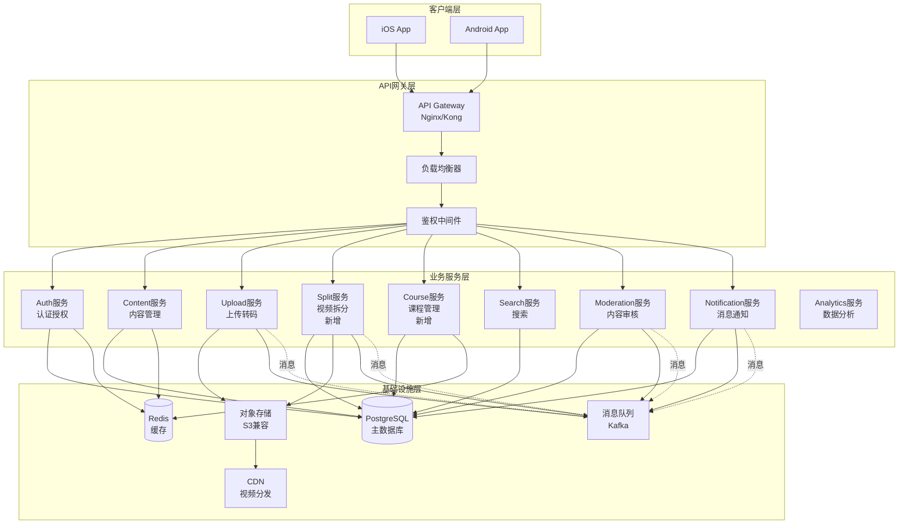
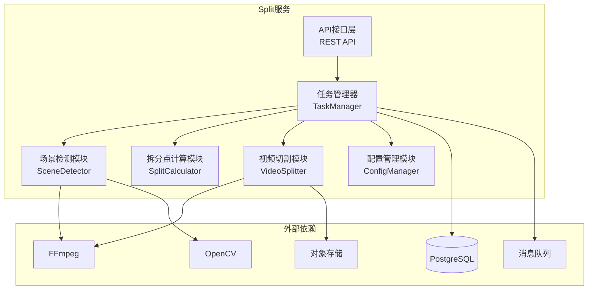
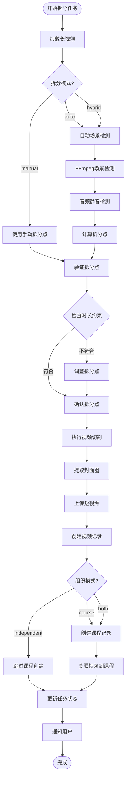
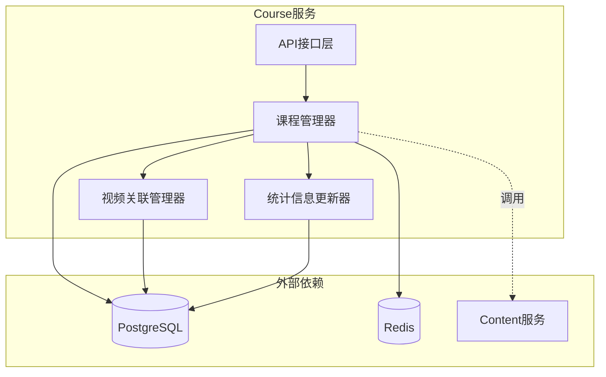
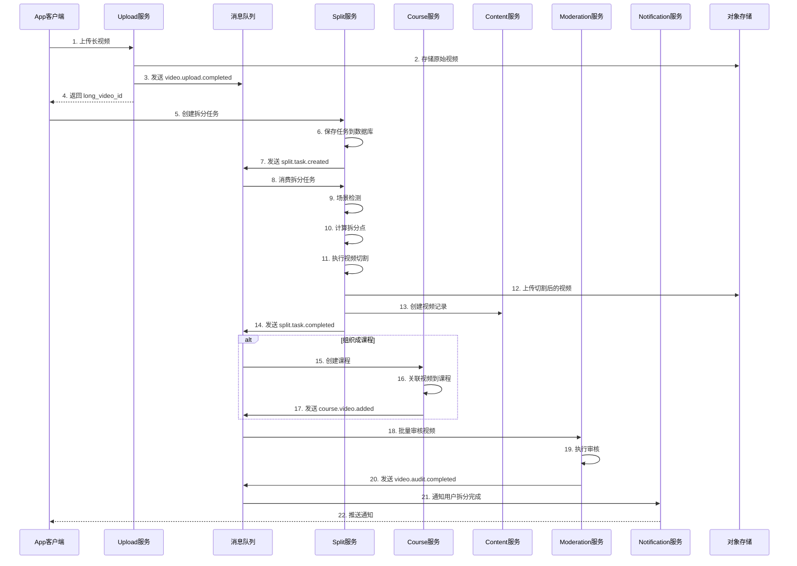
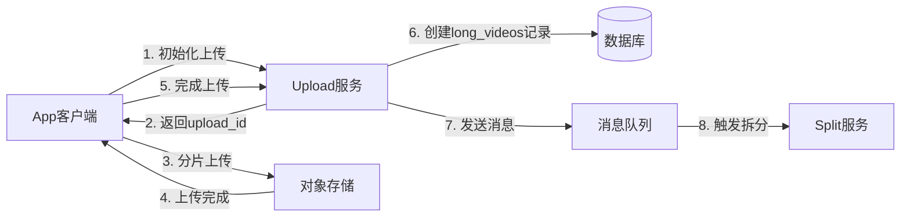
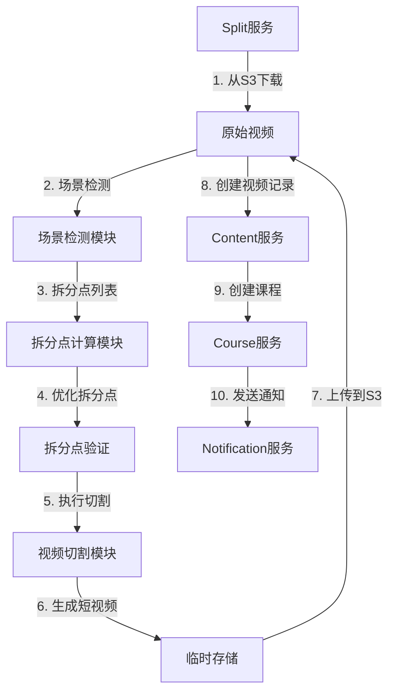
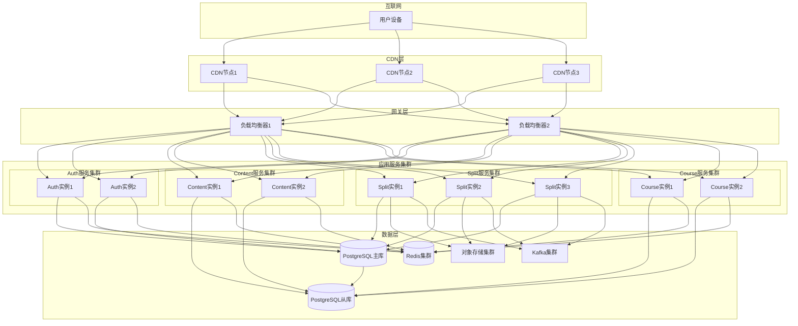

# 短视频学习平台 - 系统架构设计文档

## 一、架构概述

### 1.1 总体架构

系统采用**微服务架构**，遵循**高内聚、低耦合**的设计原则，通过API网关统一对外提供服务，各服务之间通过消息队列进行异步通信。



### 1.2 架构原则

1. **高内聚低耦合**：每个服务职责单一，服务间通过标准接口通信
2. **可扩展性**：支持水平扩展，通过负载均衡分发请求
3. **高可用性**：关键服务采用集群部署，数据库主从复制
4. **异步处理**：耗时操作（如视频转码、拆分）采用异步消息队列处理
5. **数据一致性**：通过事务和消息队列保证最终一致性

---

## 二、服务层详细设计

### 2.1 现有服务概览

| 服务名称 | 职责 | 技术栈 |
|---------|------|--------|
| Auth服务 | 用户认证、授权、风控 | Node.js/Python + JWT |
| Content服务 | 视频元数据、推荐Feed、互动 | Node.js/Python |
| Upload/Transcode服务 | 视频上传、转码、截图 | Python + FFmpeg |
| Search服务 | 全文搜索、标签筛选 | Elasticsearch/OpenSearch |
| Moderation服务 | 内容审核、举报处理 | Python + AI模型 |
| Notification服务 | 消息推送、通知管理 | Node.js/Python |
| Analytics服务 | 埋点统计、数据分析 | Python + Spark |

### 2.2 新增服务：Split服务（视频拆分服务）

#### 2.2.1 服务职责

- **场景检测**：基于FFmpeg/OpenCV检测视频场景切换点
- **拆分点计算**：根据配置计算最优拆分点
- **视频切割**：执行视频切割操作，生成多个短视频
- **任务管理**：管理拆分任务的创建、执行、状态更新

#### 2.2.2 技术架构



#### 2.2.3 核心模块设计

**1. 任务管理器（TaskManager）**
- 创建拆分任务
- 管理任务状态流转
- 协调各模块执行
- 处理任务失败重试

**2. 场景检测模块（SceneDetector）**
- 基于FFmpeg检测场景切换（`ffmpeg -vf select`）
- 基于OpenCV检测画面变化
- 检测音频静音段
- 返回场景切换时间点列表

**3. 拆分点计算模块（SplitCalculator）**
- 根据自动拆分配置计算拆分点
- 考虑最小/最大片段时长约束
- 优化拆分点位置（避免在说话中间切断）
- 支持手动调整拆分点

**4. 视频切割模块（VideoSplitter）**
- 调用FFmpeg执行视频切割
- 生成多个短视频文件
- 提取每个片段的封面图
- 上传切割后的视频到对象存储

**5. 配置管理模块（ConfigManager）**
- 管理拆分配置（自动/手动/混合）
- 验证配置参数
- 提供默认配置

#### 2.2.4 拆分算法流程



### 2.3 新增服务：Course服务（课程管理服务）

#### 2.3.1 服务职责

- **课程管理**：创建、更新、删除课程
- **视频关联**：管理课程与视频的关联关系
- **顺序管理**：管理课程中视频的播放顺序
- **统计信息**：维护课程统计数据（总视频数、总时长等）

#### 2.3.2 技术架构



#### 2.3.3 核心功能

1. **课程CRUD操作**
   - 创建课程
   - 更新课程信息
   - 删除课程
   - 查询课程列表和详情

2. **视频关联管理**
   - 添加视频到课程
   - 从课程移除视频
   - 调整视频顺序
   - 批量操作

3. **统计信息维护**
   - 自动更新课程总视频数
   - 自动更新课程总时长
   - 缓存课程统计数据

---

## 三、消息队列流程设计

### 3.1 消息队列选型

- **选型**：Apache Kafka
- **优势**：
  - 高吞吐量，适合视频处理场景
  - 支持消息持久化
  - 支持消息重试和死信队列
  - 支持多消费者组

### 3.2 主题（Topic）设计

| Topic名称 | 说明 | 生产者 | 消费者 |
|-----------|------|--------|--------|
| video.upload.completed | 视频上传完成 | Upload服务 | Split服务、Transcode服务 |
| video.transcode.completed | 视频转码完成 | Transcode服务 | Content服务、Moderation服务 |
| split.task.created | 拆分任务创建 | Split服务 | Split服务（工作队列） |
| split.task.completed | 拆分任务完成 | Split服务 | Course服务、Notification服务 |
| video.audit.completed | 视频审核完成 | Moderation服务 | Content服务、Notification服务 |
| course.video.added | 课程添加视频 | Course服务 | Content服务、Analytics服务 |

### 3.3 长视频拆分完整流程



### 3.4 消息格式定义

#### 3.4.1 视频上传完成消息

```json
{
  "event_type": "video.upload.completed",
  "timestamp": "2025-01-01T00:00:00Z",
  "data": {
    "upload_id": "UP001",
    "video_id": "V001",
    "long_video_id": "LV001",
    "video_type": "long",
    "file_url": "s3://bucket/video.mp4",
    "duration": 1800,
    "user_id": "U001"
  }
}
```

#### 3.4.2 拆分任务创建消息

```json
{
  "event_type": "split.task.created",
  "timestamp": "2025-01-01T00:05:00Z",
  "data": {
    "task_id": "ST001",
    "long_video_id": "LV001",
    "user_id": "U001",
    "split_mode": "hybrid",
    "organization_mode": "course"
  }
}
```

#### 3.4.3 拆分任务完成消息

```json
{
  "event_type": "split.task.completed",
  "timestamp": "2025-01-01T00:15:00Z",
  "data": {
    "task_id": "ST001",
    "long_video_id": "LV001",
    "user_id": "U001",
    "status": "completed",
    "total_segments": 10,
    "video_ids": ["V002", "V003", "..."],
    "course_id": "C001"
  }
}
```

---

## 四、数据流设计

### 4.1 长视频上传流程



### 4.2 视频拆分流程



---

## 五、服务间通信设计

### 5.1 同步通信（REST API）

**使用场景**：
- 用户主动触发的操作（创建任务、查询状态）
- 需要立即返回结果的场景

**通信方式**：
- HTTP/HTTPS
- RESTful API
- JSON格式

**示例**：
```http
POST /api/split/tasks
Content-Type: application/json
Authorization: Bearer <token>

{
  "long_video_id": "LV001",
  "split_mode": "hybrid",
  ...
}
```

### 5.2 异步通信（消息队列）

**使用场景**：
- 耗时操作（视频处理、拆分）
- 服务间解耦
- 批量处理

**通信方式**：
- Apache Kafka
- 主题（Topic）模式
- JSON消息格式

**示例**：
```json
{
  "event_type": "split.task.completed",
  "data": {
    "task_id": "ST001",
    "video_ids": ["V002", "V003"]
  }
}
```

### 5.3 服务发现与负载均衡

**服务发现**：
- 使用Consul或Eureka进行服务注册与发现
- 服务启动时自动注册
- 客户端通过服务名访问

**负载均衡**：
- API网关层：Nginx/Kong
- 服务层：客户端负载均衡（Ribbon）或服务端负载均衡（Nginx）

---

## 六、存储架构设计

### 6.1 数据库设计

**主数据库（PostgreSQL）**：
- 存储结构化数据（用户、视频、课程等）
- 主从复制，读写分离
- 分库分表策略（按用户ID或时间分片）

**缓存数据库（Redis）**：
- 缓存热点数据（视频详情、课程信息）
- 存储会话信息（Token）
- 分布式锁
- 排行榜数据

### 6.2 对象存储设计

**存储结构**：
```
s3://bucket/
  ├── videos/
  │   ├── original/          # 原始视频
  │   │   └── {video_id}.mp4
  │   ├── transcoded/        # 转码后视频
  │   │   └── {video_id}/
  │   │       ├── master.m3u8
  │   │       └── {resolution}/
  │   └── split/             # 拆分后的视频
  │       └── {task_id}/
  │           └── {segment_index}.mp4
  ├── covers/                # 封面图
  │   └── {video_id}.jpg
  └── thumbnails/            # 缩略图
      └── {video_id}_{timestamp}.jpg
```

### 6.3 CDN分发

- **视频文件**：通过CDN加速分发
- **静态资源**：封面图、缩略图通过CDN缓存
- **回源策略**：CDN回源到对象存储

---

## 七、部署架构设计

### 7.1 部署拓扑



### 7.2 服务部署配置

#### 7.2.1 Split服务部署

**资源配置**：
- CPU：4核+
- 内存：8GB+
- 磁盘：100GB+（临时存储视频文件）
- GPU：可选（加速场景检测）

**实例数量**：
- 生产环境：3-5个实例
- 根据任务队列长度动态扩缩容

**健康检查**：
- HTTP健康检查接口：`/health`
- 检查数据库连接、消息队列连接

#### 7.2.2 Course服务部署

**资源配置**：
- CPU：2核+
- 内存：4GB+
- 磁盘：20GB+

**实例数量**：
- 生产环境：2-3个实例
- 支持水平扩展

---

## 八、容错与高可用设计

### 8.1 服务容错

**1. 重试机制**：
- 网络请求失败：指数退避重试（最多3次）
- 消息处理失败：重试队列，最多重试5次

**2. 熔断机制**：
- 使用Hystrix或Resilience4j实现熔断
- 服务异常率超过阈值时熔断，避免雪崩

**3. 降级策略**：
- Split服务不可用时：返回错误，提示稍后重试
- Course服务不可用时：拆分任务仍可完成，课程创建延迟

### 8.2 数据一致性

**1. 最终一致性**：
- 通过消息队列保证最终一致性
- 关键操作使用分布式事务（Saga模式）

**2. 补偿机制**：
- 拆分任务失败时：清理已创建的资源
- 课程创建失败时：视频仍可独立存在

### 8.3 监控与告警

**监控指标**：
- 服务可用性（SLA > 99.9%）
- 接口响应时间（P95 < 500ms）
- 任务处理时间（拆分任务 < 30分钟）
- 错误率（< 1%）

**告警规则**：
- 服务不可用：立即告警
- 错误率超过阈值：告警
- 任务积压：告警

---

## 九、安全设计

### 9.1 认证授权

- **JWT Token**：用户认证
- **RBAC**：基于角色的访问控制
- **API密钥**：服务间通信认证

### 9.2 数据安全

- **传输加密**：HTTPS/TLS
- **存储加密**：敏感数据加密存储
- **访问控制**：对象存储使用预签名URL，设置过期时间

### 9.3 资源限制

- **上传限制**：单用户上传频率限制
- **拆分任务限制**：单用户并发拆分任务数限制（最多3个）
- **存储配额**：用户存储空间限制

---

## 十、性能优化

### 10.1 拆分性能优化

**1. 并行处理**：
- 多个拆分任务并行处理
- 单个任务内的视频切割可并行执行

**2. 缓存优化**：
- 场景检测结果缓存（相同视频不重复检测）
- 拆分配置缓存

**3. 资源优化**：
- 使用GPU加速场景检测（可选）
- 视频切割使用FFmpeg硬件加速

### 10.2 数据库优化

- **索引优化**：为常用查询字段建立索引
- **读写分离**：读操作使用从库
- **连接池**：使用连接池管理数据库连接

### 10.3 缓存策略

- **视频详情**：缓存30分钟
- **课程信息**：缓存1小时
- **拆分任务状态**：缓存5分钟

---

## 十一、扩展性设计

### 11.1 水平扩展

- **无状态服务**：所有服务设计为无状态，支持水平扩展
- **负载均衡**：通过负载均衡器分发请求
- **数据库分片**：数据量大时进行分库分表

### 11.2 功能扩展

- **拆分算法扩展**：支持新的拆分策略（如基于AI的智能拆分）
- **组织模式扩展**：支持更多组织模式（如播放列表、专题等）

---

## 十二、技术栈选型

### 12.1 后端服务

| 服务 | 技术栈 | 说明 |
|------|--------|------|
| Auth服务 | Node.js + Express | 轻量级，适合认证场景 |
| Content服务 | Python + FastAPI | 快速开发，性能好 |
| Upload服务 | Python + FastAPI | 需要调用FFmpeg |
| Split服务 | Python + FastAPI | 需要调用FFmpeg/OpenCV |
| Course服务 | Node.js + Express | 轻量级，CRUD操作 |
| Search服务 | Java + Spring Boot | 集成Elasticsearch |
| Moderation服务 | Python + FastAPI | AI模型集成 |
| Notification服务 | Node.js + Express | 消息推送 |

### 12.2 基础设施

| 组件 | 选型 | 说明 |
|------|------|------|
| 数据库 | PostgreSQL 14+ | 关系型数据库，支持JSONB |
| 缓存 | Redis 6+ | 内存数据库，高性能 |
| 消息队列 | Apache Kafka | 高吞吐量，适合视频处理 |
| 对象存储 | MinIO/阿里云OSS | S3兼容接口 |
| CDN | 阿里云CDN/腾讯云CDN | 视频分发加速 |
| API网关 | Kong/Nginx | 统一入口，负载均衡 |

### 12.3 视频处理

| 工具 | 用途 |
|------|------|
| FFmpeg | 视频转码、切割、截图 |
| OpenCV | 场景检测、画面分析 |
| FFprobe | 视频信息提取 |

---

## 十三、开发与运维

### 13.1 开发环境

- **容器化**：使用Docker Compose搭建本地开发环境
- **代码管理**：Git + GitLab/GitHub
- **CI/CD**：Jenkins/GitLab CI自动构建和部署

### 13.2 测试策略

- **单元测试**：覆盖率 > 80%
- **集成测试**：服务间接口测试
- **压力测试**：模拟高并发场景

### 13.3 日志管理

- **集中式日志**：使用ELK Stack（Elasticsearch + Logstash + Kibana）
- **日志级别**：DEBUG/INFO/WARN/ERROR
- **日志格式**：JSON格式，便于解析

---

## 十四、总结

本架构设计遵循**高内聚、低耦合**的原则，通过微服务架构实现了系统的模块化和可扩展性。新增的Split服务和Course服务与现有系统无缝集成，通过消息队列实现异步处理，保证了系统的性能和可靠性。

**关键设计亮点**：
1. **服务独立**：Split服务和Course服务独立部署，互不影响
2. **异步处理**：视频拆分采用异步消息队列，不阻塞用户操作
3. **可扩展性**：支持水平扩展，可根据负载动态调整实例数
4. **高可用性**：关键服务集群部署，数据库主从复制
5. **数据一致性**：通过消息队列和事务保证最终一致性

---

**文档结束**

