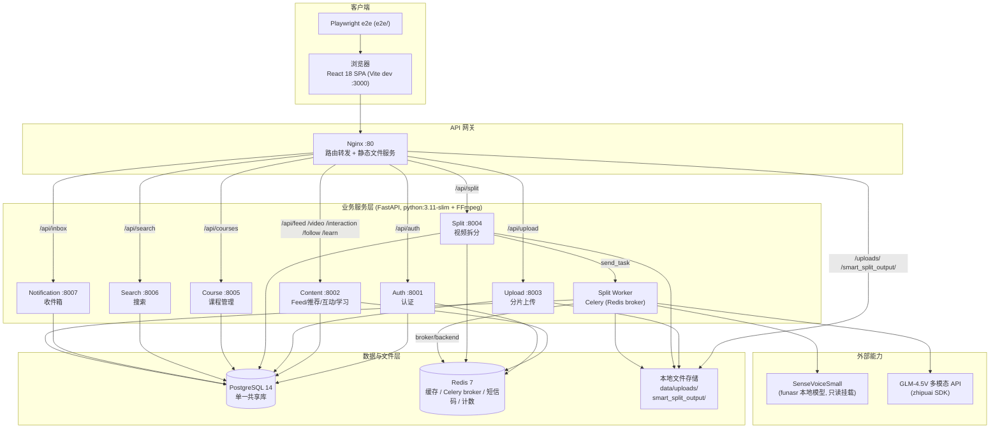
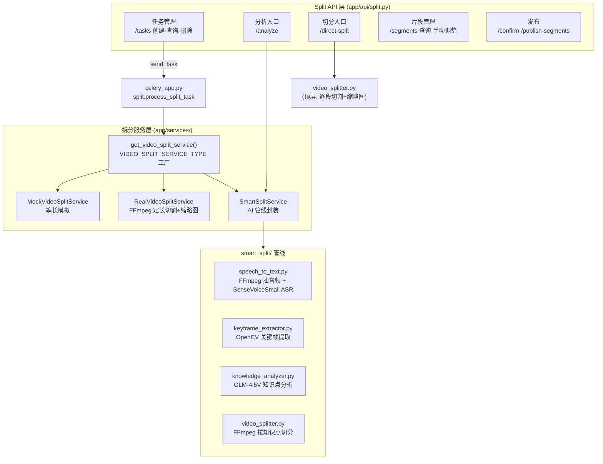
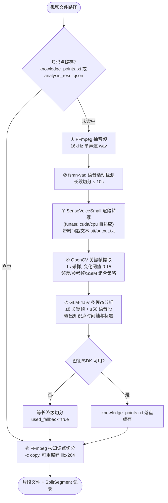
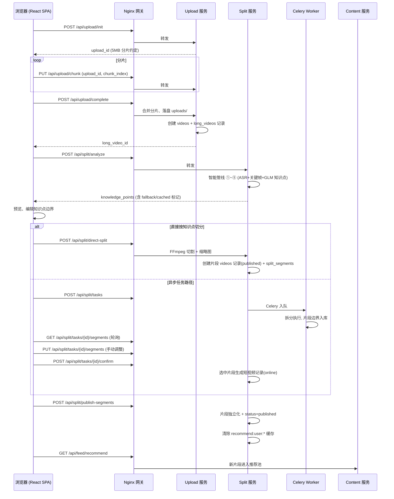

# 短视频学习平台 - 系统架构设计文档

## 一、总体架构

### 1.1 系统形态

系统面向 Web 端短视频学习场景：用户上传长视频，经 AI 管线分析为知识点片段，切分、确认后发布到推荐流，或通过课程服务组织成体系化课程。

后端由 7 个 FastAPI 服务、1 个 Celery worker、Nginx API 网关、PostgreSQL、Redis 组成，前端为 React 18 单页应用。全部服务由 Docker Compose 编排，代码位于同一仓库（backend monorepo），共享 `backend/common/` 基础库与单一 PostgreSQL 实例。

### 1.2 总体拓扑



要点：

- 客户端只有浏览器（React SPA）与驱动它的 Playwright e2e，无移动端 App。
- Vite dev server 将 `/api`、`/uploads`、`/smart_split_output`、`/videos` 代理到网关 80 端口；网关配置见 `gateway/nginx.conf`（Docker）、`gateway/nginx-local.conf`（本机）、`gateway/nginx-ci.conf`（CI）。
- 服务之间没有同步 RPC 调用。跨服务的状态流转（如拆分片段进入推荐流）通过共享数据库表和显式的 HTTP API 调用（前端经网关发起）完成。

### 1.3 架构原则

1. **单一代码库、共享基础库**：模型、数据库连接、配置、鉴权、响应格式、Redis 工具全部收敛在 `backend/common/`，各服务只做 API 层与领域逻辑。
2. **网关统一入口**：所有对外流量经 Nginx 按路径前缀路由到对应服务，静态媒体文件由网关直接以本地目录别名提供。
3. **共享数据库**：全部服务连接同一 PostgreSQL 实例，按表划分领域所有权；这是课程设计规模下的刻意取舍，换取事务简单与零分布式协调。
4. **无状态鉴权**：HTTP 接口不持有会话，凭 JWT Bearer Token 识别用户，会话状态只存在于客户端。
5. **重任务异步化**：视频分析/切割等长任务交给 Celery worker（Redis 作 broker），API 进程保持快速响应。
6. **AI 链路可降级**：智能拆分依赖缺失或 GLM 密钥未配置时，自动回退到等长切分，链路不中断。

---

## 二、服务设计

### 2.1 服务清单

| 服务 | 端口 | 路由前缀 | 职责 |
|------|------|---------|------|
| Auth | 8001 | `/api/auth` | 手机号验证码登录、JWT 签发/刷新、用户资料 |
| Content | 8002 | `/api/feed`、`/api/video`、`/api/interaction`、`/api/follow`、`/api/learn` | 推荐 Feed、视频详情、点赞/收藏/评论、关注、学习进度 |
| Upload | 8003 | `/api/upload` | 分片上传、合并落盘、Video/LongVideo 建档、图片上传 |
| Split | 8004 | `/api/split` | 拆分任务管理、智能分析、切分执行、片段发布 |
| Course | 8005 | `/api/courses` | 课程 CRUD、视频关联与排序 |
| Search | 8006 | `/api/search` | 关键词/标签/时长搜索、搜索建议 |
| Notification | 8007 | `/api/inbox` | 站内消息列表与已读标记 |
| Split Worker | - | - | Celery worker，消费 `split.process_split_task`，运行拆分/AI 管线 |

七个服务均为 Python + FastAPI + SQLAlchemy 2.x，监听 `0.0.0.0`，暴露 `GET /` 与 `GET /health`，启动时经 `init_db()` 兜底建表，schema 演进由 Alembic 管理（见 3.4.1）。

### 2.2 Auth 服务

- `POST /api/auth/send-code`：生成 6 位验证码，存入 Redis（键 `sms_code:{phone}`，TTL 300s），经短信服务发送。短信层为策略接口：开发环境 MockSMS（日志输出，响应体附带验证码），可切换阿里云/腾讯云 SDK。
- `POST /api/auth/login`：校验验证码，超过 5 次错误尝试作废；验证通过按手机号查建用户并签发 JWT。
- `POST /api/auth/refresh`：以有效 Token 换取新 Token。
- `GET/PUT /api/auth/profile`：读取与更新资料（昵称、头像、简介、性别、学校、语言等）。
- 用户 `roles`（admin/creator/learner）随档案返回，接口层统一按登录态与资源归属授权（见 6.1）。

### 2.3 Content 服务

**推荐引擎**（`app/services/recommendation.py`）提供四种算法，`GET /api/feed/recommend?strategy=` 选择 `hybrid|content|collaborative|popularity`，默认 hybrid：

- ContentBasedRecommender：由点赞/收藏/评论/学习行为构建标签、作者、语言兴趣画像，按画像打分。
- CollaborativeFilteringRecommender：User-Item 行为共现，找相似用户偏好物品。
- PopularityRecommender：热度分（互动加权和 × 时间衰减，`common/utils/stats.py::calculate_hot_score`）。
- HybridRecommender：内容 0.6 / 协同 0.4 的加权混合，另支持切换（行为数 < 10 的新用户走内容推荐）与级联（内容不足时协同补齐）策略。

推荐结果按 `recommend:user:{user_id}:{strategy}` 缓存于 Redis（TTL 3600s），新视频发布时按模式清键保新鲜。

**其余接口面**：`/api/feed/diverse`、`/personalized`、`/feedback`、`/following`（关注流）、`/hot`、`/search`、`/my_videos`、`/video/{id}`（详情，附带上次播放位置）；`/api/interaction/*` 点赞、收藏、评论发表/列表/删除；`/api/follow/*` 关注、取关、粉丝/关注列表；`/api/learn/*` 心跳上报（更新 `learn_records` 进度，完成度 ≥ 90% 自动标记 completed）、完成标记、记录查询。Feed 与详情的统计字段（点赞/评论/收藏数）用批量聚合查询组装，避免 N+1。

### 2.4 Upload 服务

上传协议为「初始化 → 分片 PUT → 完成合并」三步，全程 HTTP 经网关，不直连存储：

1. `POST /api/upload/init`：登记 `upload_tasks`（文件名、大小、时长、`video_type: short|long`），返回 `upload_id` 与 5MB 分片尺寸约定。
2. `PUT /api/upload/chunk`：分片按 `upload_id`、`chunk_index` 请求头写入临时目录（`$TMPDIR/upload_chunks/{upload_id}/chunk_N`），支持乱序与续传。
3. `POST /api/upload/complete`：按索引合并分片、校验总大小、计算 MD5，经存储抽象层落盘，创建 `videos` 记录；`video_type=long` 时同步创建 `long_videos` 记录（`split_enabled=true`）并返回 `long_video_id` 供拆分流程使用。

存储层（`app/services/storage.py`）为接口 + 工厂：默认 `LocalStorageService`，基目录取 `UPLOAD_BASE_DIR`（容器内 `/app/data/uploads`，映射宿主机 `backend/data/`），返回 `/uploads/...` 相对 URL 由网关静态服务；`STORAGE_TYPE=s3` 时切换 S3StorageService（boto3，兼容 MinIO），属部署选项而非默认链路。上传的视频以原文件直接播放，当前链路不含转码。

`POST /api/upload/image` 接收 Base64 图片，供头像与封面使用。

### 2.5 Split 服务

#### 2.5.1 模块结构



#### 2.5.2 拆分实现选择

`get_video_split_service()` 按环境变量 `VIDEO_SPLIT_SERVICE_TYPE` 返回实现：

| 实现 | 行为 | 适用 |
|------|------|------|
| `mock`（默认） | 固定按 300s 时长、`segment_duration` 等长生成边界，不调用 FFmpeg | 开发与自动化测试 |
| `real` | ffprobe 取时长，按 `segment_duration`（默认 60s）定长切分，短片段并入前段、超 `max_duration` 截断；FFmpeg `-c copy` 出文件并抽中帧缩略图 | 无 AI 依赖的环境 |
| `smart`（Docker Compose 采用） | 走 2.5.3 智能管线，结果按长视频 UUID 缓存于 `smart_split_output/{uuid}/` | 生产演示 |

smart 加载失败（torch/opencv/funasr 未装）或管线异常时自动回退 `_fallback_split` 等长切分；GLM 未配置密钥或 SDK 缺失时知识点分析同样降级等长，响应以 `used_fallback` 标记。

#### 2.5.3 智能拆分管线



分析与切割解耦：`POST /api/split/analyze` 只跑 ①~⑤ 返回知识点供用户预览编辑；`POST /api/split/direct-split` 携带（可被用户修改过的）知识点同步执行 ⑥，逐段产出 `smart_split_output/{long_video_id}/segments/` 下的文件与缩略图，并为每段落一条 `videos` 记录（`status=published`）关联到 `split_segments.video_id`。

#### 2.5.4 异步任务路径与任务生命周期

`POST /api/split/tasks` 创建任务（携带 `split_mode: auto|manual|scene`、`auto_config`、`organization_mode: course|standalone`）后，经 Celery `send_task('split.process_split_task')` 入队，worker 以 `process_split_task_sync` 执行：解析视频文件路径（`/uploads/...` → 部署对应的本地基路径）、调用当前拆分服务实现、把片段边界写入 `split_segments`（时间区间、缩略图、scene_type、置信度）。任务状态机：

```
pending → queued → processing → completed → confirmed
                 ↘ failed（错误信息落 error_message）
```

completed 后用户可：`GET /tasks/{id}/segments` 与 `/result` 查看；`PUT /tasks/{id}/segments` 手动调整边界（校验起止序与不重叠，标记 `scene_type=manual`）；`POST /tasks/{id}/confirm` 勾选片段生成短视频记录（`status=online`，`parent_video_id` 指向长视频）；`POST /publish-segments` 把片段提升为独立视频发布到主页（`parent_video_id` 置空、`status=published`）并清除全站推荐缓存。`POST /simple-split` 为前端演示用的模拟端点。

`organization_mode` 记录任务的组织意图，课程的建立与视频编排在 Course 服务侧完成（见 2.6）。

### 2.6 Course 服务

- 课程 CRUD：`POST/GET/PUT /api/courses`、`GET /api/courses/{id}`（详情含按 `segment_index` 排序的视频列表）。
- 视频关联：`POST /api/courses/{id}/videos` 添加、`DELETE /api/courses/{id}/videos/{video_id}` 移除、`PUT /api/courses/{id}/videos/order` 整体重排。
- 统计一致性：`courses.total_videos` 与 `total_duration` 由 PostgreSQL 触发器（`update_course_stats`，见 Alembic 003）在 `course_videos` 增删时维护，应用层无需回写。
- 数据模型：`courses`（作者、标题、标签数组、语言、封面、状态）+ `course_videos`（课程-视频多对多，带段序）。

### 2.7 Search 服务

`GET /api/search/videos` 在 `status=online` 的短片集合上组合过滤：关键词对标题/描述做 PostgreSQL `ILIKE`（通配符转义防注入）、`tags` 数组包含（`@>`，走 GIN 索引）、时长区间、语言，支持 latest/popularity 排序与分页；返回结果附播放计数（读 Redis）与热度分。`GET /api/search/suggest` 从标题与标签中做前缀式联想。搜索由关系库承担，未引入独立搜索引擎。

### 2.8 Notification 服务

提供收件箱读侧：`GET /api/inbox/messages`（按类型 `comment_reply|audit_result|system|split_completed`、已读状态过滤，未读优先、时间倒序、分页）与 `POST /api/inbox/read`（按 ID 或全量标记已读）。消息写入方（拆分完成、审核结果等事件的生产者）尚未接入任何服务链路，属演进方向（见 8.4）。

### 2.9 共享基础库 `backend/common/`

| 模块 | 内容 |
|------|------|
| `models/` | 全部 SQLAlchemy 模型（14 张表，见 3.4.1），各服务共享同一套实体定义 |
| `database/connection.py` | 引擎与会话工厂、`get_db` 依赖、PostgreSQL 强校验（非 postgres 连接串直接拒绝启动）、Redis 客户端获取（开发环境容忍 Redis 缺席）、`init_db` 与演示用户种子 |
| `config/settings.py` | pydantic-settings 统一配置：JWT、CORS、DB、Redis、Kafka 地址、短信码策略、GLM 密钥；生产环境强制 JWT 密钥并禁止 `CORS=*` |
| `utils/auth.py` | `get_current_user` / `get_optional_user`：Bearer JWT（HS256）校验；开发环境接受 36 位 UUID 直通并自动建用户 |
| `utils/response.py` | 统一 `success_response` / `error_response` 包裹结构 |
| `utils/redis_client.py` | 短信码存取与尝试计数、推荐缓存读写与失效，Redis 不可用时降级进程内字典 |
| `utils/stats.py` | 播放计数（Redis 键 `video:play_count:*`，24h 同用户去重）与热度分公式 |
| `messaging/` | kafka-python 生产者/消费者封装与 Topic 定义，供接入事件总线时使用，当前无业务调用方 |

---

## 三、横切设计

### 3.1 认证与鉴权

- 凭据：`Authorization: Bearer <JWT>`，HS256 签名，载荷 `sub=user_id` + `exp`，访问令牌默认 30 分钟，`/api/auth/refresh` 续签。全链路无 Session、无服务端会话表。
- 校验：各服务经 `common/utils/auth.py` 统一解码；网关只做路径路由，不改写认证头。
- 授权：资源归属检查在端点内完成（如拆分任务/长视频操作校验 `user_id`/`author_id` 与当前用户一致，越权返回 403/404）。
- 开发模式：`ENVIRONMENT=development` 时接受 UUID 形式的 token 直通并自动建档用户，验证码随响应返回，仅用于本地联调。

### 3.2 异步任务机制

系统的异步执行由 **Celery（5.x）+ Redis broker** 承担，专用于 Split 的拆分任务：

- 定义：`services/split/app/celery_app.py`，broker 与 result backend 均为 `redis://…/0`。
- 任务：`split.process_split_task(split_task_id)`，worker 容器复用 split 镜像，`--concurrency=1`（视频处理串行，避免磁盘/CPU 争抢），与 split API 共享代码目录和输出卷。
- 提交：API 进程仅 `send_task` 入队，失败则任务直接置 failed；进度经 `progress`/`progress_message` 字段落库，由前端轮询任务接口获取。

其余操作（上传合并、direct-split、confirm）为请求内同步执行。Compose 部署同时启动 Zookeeper/Kafka broker 并为部分服务注入 `KAFKA_BOOTSTRAP_SERVERS`，属预留基础设施，业务链路的事件总线接入见演进方向（8.1）。

### 3.3 服务间通信与数据共享

- **对外**：客户端只访问网关 80 端口的 `/api/*`；REST + JSON。
- **服务之间**：零直接调用。不存在服务到服务的 HTTP client，也不存在跨服务读对方连接池之外的数据。
- **共享状态**：单一 PostgreSQL 库按表划界（`videos`、`long_videos`、`split_*`、`courses`、`course_videos`、`learn_records` 等），一个服务的产出（如 direct-split 写入的 `videos` 行）经表成为另一服务的输入（Content 推荐读 `status=published`）。
- **缓存失效协同**：Split 发布片段后直接清 Content 的 Redis 推荐键（`recommend:user:*`），这是两处唯一显式的跨服务协作点。

### 3.4 存储架构

#### 3.4.1 PostgreSQL（唯一持久化数据库）

- 版本与驱动：PostgreSQL 14（compose 镜像 `postgres:14`），SQLAlchemy 2.x + psycopg/psycopg2；连接串强制 postgres 协议，代码不提供其他方言退路。
- Schema 演进：Alembic 迁移 001 initial、002 tags GIN 索引、003 updated_at 触发器与课程统计触发器、004 follows 表、005 用户资料字段。
- 表清单：`users`、`videos`、`long_videos`、`upload_tasks`、`split_tasks`、`split_segments`、`courses`、`course_videos`、`learn_records`、`comments`、`likes`、`favorites`、`follows`、`notifications`。
- 特色点：`tags` 数组列配 GIN 索引支撑标签检索；`updated_at` 由库内触发器统一维护。

#### 3.4.2 Redis

| 用途 | 键形态 | TTL |
|------|--------|-----|
| 短信验证码与尝试计数 | `sms_code:{phone}` | 300s |
| 推荐结果缓存 | `recommend:user:{id}:{strategy}` | 3600s |
| 播放计数 | `video:play_count:{id}`、`video:user_play:{id}:{uid}` | 30d / 24h |
| Celery broker 与 result backend | Celery 内部队列键 | - |

#### 3.4.3 文件存储与分发

媒体文件为本地磁盘目录 + 网关静态别名，无对象存储服务与 CDN：

```
backend/data/
  └── uploads/                       # 上传合并后的原始文件（网关 /uploads/* 暴露）
services/split/
  └── smart_split_output/{long_video_uuid}/
      ├── audio/  stt/  keyframes/   # 管线中间产物
      ├── knowledge/knowledge_points.txt   # 分析缓存
      ├── analysis_result.json       # 分析结果缓存
      └── videos/  segments/         # 切出的片段与缩略图（网关 /smart_split_output/* 暴露）
```

Docker 下 `./data` 绑定挂载进 upload/split/worker/网关容器，`split-output` 命名卷供 split、worker 与网关共享切分产物。视频播放 URL 即数据库中的 `/uploads/...` 或 `/smart_split_output/...` 相对路径。S3/MinIO 适配已实现（STORAGE_TYPE=s3），作为部署可选形态保留。

---

## 四、核心流程

### 4.1 长视频上传 → 拆分 → 发布端到端流程



课程组织路径独立于拆分：客户端调用 `POST /api/courses` 建课，再 `POST /api/courses/{id}/videos` 把片段按段序加入，统计字段由库触发器更新。

---

## 五、部署架构

### 5.1 Docker Compose 拓扑

| 组件 | 镜像/构建 | 端口 | 说明 |
|------|-----------|------|------|
| postgres | postgres:14 | 5432 | 卷 `postgres_data`，healthcheck `pg_isready` |
| redis | redis:7-alpine | 6379 | Celery broker + 缓存，healthcheck ping |
| zookeeper / kafka | confluentinc 7.5.0 | 2181 / 9092 | 随栈部署的预留消息设施，业务事件总线路径见 8.1 |
| auth-service | `services/auth/Dockerfile` | 8001 | 依赖 postgres、redis |
| content-service | `services/content/Dockerfile` | 8002 | 依赖 postgres、redis、kafka |
| upload-service | `services/upload/Dockerfile` | 8003 | 挂载 `./data`，`UPLOAD_BASE_DIR=/app/data/uploads` |
| split-service | `services/split/Dockerfile` | 8004 | `VIDEO_SPLIT_SERVICE_TYPE=smart`，只读挂载 `../SenseVoiceSmall` |
| split-worker | 同 split 镜像 | - | `celery worker --concurrency=1`，共享 `split-output` 卷与模型挂载 |
| course-service | `services/course/Dockerfile` | 8005 | 依赖 postgres |
| search-service | `services/search/Dockerfile` | 8006 | 依赖 postgres |
| notification-service | `services/notification/Dockerfile` | 8007 | 依赖 postgres、kafka |
| gateway | nginx:alpine | 80 | 挂载 `gateway/nginx.conf`、`./data`、`split-output` |

所有服务镜像基于 `python:3.11-slim`，apt 层安装 FFmpeg 与 OpenCV 运行库（libgl1、libglib2.0-0、libmagic1）。

### 5.2 网关路由表

| 路径 | 上游 | 特例 |
|------|------|------|
| `/api/auth/*` | auth:8001 | |
| `/api/feed`、`/api/video`、`/api/interaction`、`/api/follow`、`/api/learn` | content:8002 | |
| `/api/upload/*` | upload:8003 | `client_max_body_size 10G`；透传 `upload_id`、`chunk_index` 自定义头 |
| `/api/split/*` | split:8004 | GLM 分析耗时长，connect/send/read 超时 900s |
| `/api/courses*` | course:8005 | |
| `/api/search/*` | search:8006 | |
| `/api/inbox/*` | notification:8007 | |
| `/uploads/` | 静态 `data/uploads/` | 本地 alias，1h 缓存头，CORS 放开 |
| `/smart_split_output/` | 静态 `split-output` 卷 | 同上 |
| `/videos/` | 静态 `data/videos/` | 预置演示视频，1d 缓存 |
| `/health` | 网关自身 | 固定 200 healthy |

### 5.3 非容器形态

- **本机开发**：`nginx -c gateway/nginx-local.conf` 以 127.0.0.1:800x 上游运行同一套路由；前端 Vite（:3000）代理到 :80。数据库与 Redis 亦可本机brew/独立部署，仅需 `DATABASE_URL` 或 `DB_*`、`REDIS_*` 环境变量。
- **CI**：`gateway/nginx-ci.conf` 对接单机直连端口；测试栈由 `backend/tests/`（pytest 单元 + API 用例）、`scripts/check_coverage_gates.py`（覆盖率门槛）、`e2e/`（Playwright，baseURL http://localhost:3000）构成。
- **性能测试**：本机微基准 `perf/locustfile.py` + 部署形态基线 `perf/locustfile_gateway.py`（Docker 全栈打网关 :80，独立 200ms/1% 阈值），权威数据见 `perf/BASELINE.md`。

### 5.4 健康检查

七服务与 worker 依赖组件均有 `GET /health`（auth 附带版本与时间戳）；compose 对 postgres/redis/kafka 配置 healthcheck 并以 `condition: service_healthy` 控制启动顺序；网关 `/health` 供探活。

---

## 六、安全设计

### 6.1 接口安全

- JWT Bearer 统一鉴权（3.1），生产强制自定义密钥；令牌过期经 refresh 端点续签。
- 短信通道：验证码 6 位、5 分钟有效、单号最多 5 次校验尝试。
- CORS 由配置白名单驱动，生产环境禁止通配来源。
- SQL 层面：ORM 参数化 + LIKE 通配符转义 + 连接串类型校验。
- 上传控制：分片协议限制单片 5MB，网关单请求 10G 上限，视频操作强制登录态。

### 6.2 数据与文件边界

媒体目录仅暴露只读静态别名；数据库口令与 JWT/GLM 密钥经环境变量注入（`env.example` 约定），配置校验拒绝以默认密钥进入生产。

---

## 七、性能与可靠性现状

- **读取路径**：推荐结果 Redis 缓存 1h；Feed 统计批量聚合防 N+1；标签 GIN 索引；课程统计触发器免应用回写。
- **处理路径**：Celery 单并发 worker 顺序消化拆分任务，API 响应与视频处理时长解耦；拆分与分析产物按长视频 UUID 缓存，重复分析直接命中；FFmpeg `-c copy` 流复制切割避免全片重编码。
- **降级路径**：AI 依赖缺失→等长切分；GLM 异常→`used_fallback`；Redis 缺席→短信码进程内内存降级（开发容忍，生产启动失败）；拆分失败→`error_message` 落库可查。
- **已知边界**：单库单实例、单网关、单 worker；服务副本、库主备、熔断限流等大规模手段见下一章。

---

## 八、演进方向

> 本章为前瞻设计，所列能力当前未实现。

1. **事件总线化**：将上传完成、拆分完成、审核结果等事件投递到已部署的 Kafka（`common/messaging/` 封装与 Topic 定义就绪），替代共享表轮询与直连缓存清理，实现服务间事件驱动解耦。
2. **转码流水线**：上传后异步转码多码率 HLS，补齐 `transcoding` 初始状态的消费方，配合 S3/MinIO 与 CDN 完成大流量分发。
3. **独立审核与分析服务**：内容审核（Moderation）与埋点分析（Analytics）服务化，审核结论驱动视频状态机，分析数据反哺推荐。
4. **通知生产侧**：拆分完成、审核结果、互动回复等事件写入 `notifications`，打通收件箱全链路。
5. **搜索升级**：数据量增长后将 ILIKE 匹配迁移至 Elasticsearch/OpenSearch，复用 suggest 与过滤协议。
6. **规模化部署**：服务多副本 + 网关负载均衡、PostgreSQL 主从读写分离、worker 按队列深度弹性扩缩、RBAC 角色权限细化。
7. **高可用补强**：任务重试与死信策略、跨服务调用的超时熔断与降级预案、集中式日志与指标告警。

---

**文档结束**
