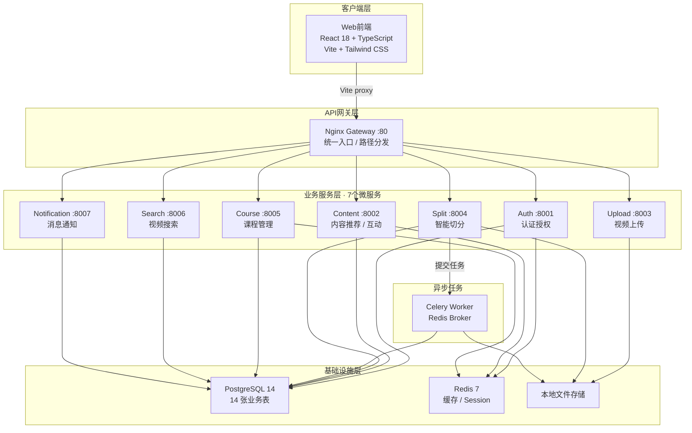

# 短视频学习平台 · 项目展示讲解内容

> **项目定位**：基于 AI 的智能短视频学习平台。集成 SenseVoice 语音识别、GLM-4.5V 多模态分析和智能推荐系统，采用微服务架构，提供完整的视频处理、内容推荐、课程管理等功能。

---

## 开场

各位老师好。今天展示的是一个短视频学习平台，核心是把长视频自动切成带知识点的短视频片段，再按用户兴趣做个性化推荐。

一句话概括：**上传一段长视频，系统自动识别语音、切出知识点、生成可学习的短视频，并按兴趣推给合适的用户。**

整个系统用微服务架构落地，7 个服务独立部署，通过 Nginx 网关统一对外。下面我从架构、技术亮点、测试体系、演示路径四个部分展开。

---

## 一、系统架构

### 1.1 微服务划分

系统按业务领域拆成 7 个微服务，每个服务职责单一，通过 RESTful API 通信，共暴露 56 个端点：

| 服务 | 端口 | 职责 |
|------|------|------|
| Auth | 8001 | 认证授权、用户资料 |
| Content | 8002 | 内容推荐、Feed 流、用户互动 |
| Upload | 8003 | 视频上传、分片管理 |
| Split | 8004 | 视频智能切分、任务管理 |
| Course | 8005 | 课程管理、学习进度 |
| Search | 8006 | 视频搜索 |
| Notification | 8007 | 消息通知 |

前端开发环境通过 Vite dev server（:3000）代理到 Nginx 网关（:80），生产环境前端静态资源由 Nginx 直接托管。网关按路径前缀把请求分发到对应服务，服务之间不直接调用。数据库用 PostgreSQL 14，缓存用 Redis 7，异步任务用 Celery（Redis broker）。

### 1.2 高内聚低耦合

**高内聚**：每个服务只做一件事。Auth 只管认证，Upload 只管上传，Split 只管切分，互不越界。

**低耦合**靠三件事保证：

1. **共享库 `common/`**：14 张数据模型、配置、工具函数统一放在 `common/` 目录，各服务复用，改一处全服务生效。
2. **Celery 异步解耦**：视频切分是耗时操作（涉及 ASR + 多模态分析），通过 Celery + Redis broker 异步执行，Split API 收到请求后把任务丢给 Worker，前端轮询进度，不阻塞主线程。
3. **统一接口规范**：所有服务用统一的响应格式（`success_response`、`error_response`），前端对接一套规范走到底。

### 1.3 技术选型

| 技术 | 用途 |
|------|------|
| FastAPI | 异步 Web 框架，自动生成 API 文档 |
| PostgreSQL 14 | 主数据库，14 张业务表，22 个索引 |
| Redis 7 | 缓存（推荐结果 1 小时 TTL）、Celery broker |
| Celery | 异步任务队列，仅用于 Split 服务的切分任务 |
| SQLAlchemy + Alembic | ORM 与数据库迁移（Alembic 管理 schema 变更） |
| Docker Compose | 容器化部署（含 PostgreSQL、Redis、7 个服务、Nginx 网关） |
| React 18 + TypeScript | 前端框架 |
| Vite + Tailwind CSS | 构建工具 + 样式方案 |

---

## 二、技术亮点

### 2.1 AI 智能处理：5 步切分流程

智能切分是系统的核心能力，把一段长视频切成带知识点的短视频，走 5 步：

1. **音频提取**：FFmpeg 把视频里的音频抽出来，转成 16kHz WAV。
2. **语音识别**：SenseVoiceSmall 模型把语音转成文字，支持中、日、韩、英、粤多语言。
3. **关键帧检测**：OpenCV 用直方图差分识别场景切换，找出画面变化点，提取关键帧。
4. **知识点分析**：GLM-4.5V 多模态模型理解视频内容，结合语音转写文本和关键帧图片，识别教学内容的边界，生成知识点列表。
5. **视频分割**：按知识点边界用 FFmpeg 精准切分，生成独立片段。

这套流程的亮点是**多模态融合**，语音、视觉、文本三种信号一起用。

更关键的设计是**确定性降级**：未配置 GLM API Key 或 AI 重型依赖（torch/opencv）未安装时，系统自动切换到等长切分降级路径，按固定时长均分视频。这不是事后补丁，而是从架构层面设计的双模式策略。降级路径走纯确定性逻辑，零外部依赖，保证系统在任何环境下都能跑起来。AI 依赖就位后自动升级到智能模式，无需改代码。

### 2.2 智能推荐：4 种算法

推荐系统实现了 4 种算法，按策略切换：

1. **内容推荐**（Content-based）：基于用户历史行为（点赞、收藏、学习记录）构建画像，用加权特征相似度找相似视频。标签权重 0.4、作者 0.3、语言 0.2、类型 0.1。
2. **协同过滤**（Collaborative Filtering）：用 Jaccard 相似度找行为模式相似的用户，推荐他们看过但目标用户没看过的视频。行为权重：点赞 0.3、收藏 0.4、学习 0.3。
3. **热度推荐**（Popularity）：按互动量（点赞 + 评论×0.5 + 收藏×1.5）排序，支持按天/周/月时间窗口筛选。
4. **混合推荐**（Hybrid）：默认把内容推荐（60%）和协同过滤（40%）加权融合，支持加权、切换、级联三种融合策略。切换策略对新用户（行为数 < 10）走内容推荐解决冷启动，老用户走协同过滤。

推荐结果用 Redis 缓存，缓存 1 小时。用户行为变更时自动失效缓存。

### 2.3 微服务实践

- **服务独立部署**：7 个服务各自独立端口，可独立开发、测试、扩容。Docker Compose 一键拉起全栈。
- **共享库复用**：14 张数据模型、配置、工具函数统一管理，改一处全服务生效。
- **接口标准化**：统一响应格式，异常处理器全局拦截，前端对接一套规范走到底。

### 2.4 性能优化

- **数据库**：SQLAlchemy 连接池（pool_size=5, max_overflow=10）复用连接；高频查询字段建索引，模型里定义了 22 个索引；用 JOIN 减少数据库往返。
- **缓存**：推荐结果缓存 1 小时，用户会话信息走 Redis，降低数据库压力。
- **异步处理**：切分任务走 Celery + Redis broker，不阻塞主线程，Worker 并发可调。
- **性能基线**：用 Locust 对核心读接口做了压测基线。20 并发下，推荐流、热门流、搜索、认证链路四个接口聚合 P95 约 53ms，失败率 0，远低于 500ms 的目标门禁。脚本内建阈值（P95 ≤ 500ms、失败率 ≤ 1%），超标时非零退出码失败，可接入 CI 做性能回归门禁。部署形态（Docker 全栈经网关 + Redis 缓存）也已压测：200 并发 P95 47ms / 吞吐 147.5 RPS / 0 失败全过门禁（独立 200ms 阈值），网关转发+容器化叠加开销仅 ≈+15ms P95。基线数据记录在 `perf/BASELINE.md`。

---

## 三、测试体系

测试分四层，从单元到端到端逐级覆盖：

### 3.1 后端自动化：315 个 pytest 用例

32 个测试文件，覆盖 API 集成测试 164 例 + 单元测试 151 例，其中 42 例是参数化矩阵（覆盖认证边界、输入校验、工厂分支）。

测试基础设施的关键设计：

- **ASGI TestClient 内存直连**：每个服务的 FastAPI app 通过 `dependency_overrides` 注入测试数据库会话，不经过 HTTP，测试跑在内存里。
- **函数级级联清理**：每个用例结束后，用 `DROP TABLE ... CASCADE` 逐表清理，保证用例之间零干扰。
- **独立测试库**：测试跑在 `short_video_platform_test` 库上，和开发数据完全隔离。
- **Redis 内存降级锁定**：通过 monkeypatch 统一让 `get_redis()` 返回 None，测试走内存存储路径，行为与 Redis 是否可用无关。

### 3.2 覆盖率门禁

两道门禁：

1. **总量门禁**：`pytest.ini` 配置 `--cov-fail-under=70`，总量覆盖率低于 70% 时测试失败。
2. **分级门禁**：`scripts/check_coverage_gates.py` 对 5 个核心模块设独立底线，防总量掩盖局部退化：

| 模块 | 底线 |
|------|------|
| `keyframe_extractor.py` | 10% |
| `video_splitter.py` | 15% |
| `smart_split_service.py` | 45% |
| `knowledge_analyzer.py` | 60% |
| `speech_to_text.py` | 60% |

### 3.3 前端测试：10 个 Vitest 用例

覆盖登录页（手机号校验、验证码流程、登录跳转）、受保护路由（未登录重定向、已登录渲染、加载态）、AuthContext（login/logout/updateUser）三个核心模块。

### 3.4 端到端测试：Playwright

5 个 spec 文件、6 条用例，覆盖登录、首页、搜索、上传、切分五条链路，走真实浏览器验证。

### 3.5 手工测试与执行留痕

自动化管回归，手工管"机器判不了"的部分：[手工测试用例-正式版](手工测试用例-正式版.md) 共 56 条编号用例（发布冒烟 16 + 核心功能 28 + 探索 8 + 兼容 4，另沿用视觉验收 V1-V8），压缩出 29 条发布前快查清单。执行结果逐条写回"实际结果/状态"列，一手证据归档在 [`manual-evidence/`](manual-evidence/)：

- **UI 类**：`cd e2e && npm run evidence` 用专门的留痕配置跑发布冒烟链路，逐例截图 + 完整 trace；
- **接口/数据一致性类**：`backend/scripts/manual_smoke_upload.py` 跑真实分片上传，输出"状态码 + 响应体业务字段 + 数据库落库行"三段现场；
- **没跑的条目保留未执行状态并写明原因**（需真机浏览器、需人眼判视觉、需多角色造数），不拿"设计过"冒充"执行过"。

2026-09-09 本轮执行 20 条，并因执行而回头修正了 3 条**用例自身预期错误**（点赞是切换语义、越权合并应期 404、关键词长度需按端点拆分）——详见正式版 §七与测试总结报告 §6。

### 3.6 配套建设

配套建设了框架无关的测试平台 CaseForge，对本服务做接口回归测试。CaseForge 是独立仓库，细节不展开。

---

## 四、演示路径

按一条完整业务链路走一遍，从注册到看到推荐内容：

1. **启动服务**：`docker-compose up -d` 拉起 PostgreSQL、Redis、7 个服务和 Nginx 网关。前端 `npm run dev` 启动 Vite dev server（:3000），代理到网关（:80）。
2. **注册登录**：手机号发验证码，输入验证码登录，自动注册，拿到 JWT Token。
3. **上传视频**：走分片上传，每片 5MB，支持断点续传，上传完成后自动分类长短视频。
4. **智能切分**：对长视频发起切分任务，系统走 5 步流程（或降级等长切分），Celery Worker 异步执行，前端轮询进度，产出带知识点的片段。
5. **浏览推荐流**：进入首页，看混合推荐的结果，切换热门流、关注流。
6. **搜索**：按关键词搜视频，看搜索结果。
7. **课程与学习**：打开课程，播放课内视频，记录学习进度。

这条链路把 7 个服务全部串起来，能完整展示系统的核心能力。

---

## 五、总结

这个项目用微服务架构落地了一个完整的短视频学习平台，核心价值有三点：

1. **AI 能力落地**：SenseVoiceSmall 语音识别、GLM-4.5V 多模态分析、OpenCV 场景检测，把长视频自动切成带知识点的短视频。未配置 AI 依赖时自动降级到等长切分，保证系统始终可用。
2. **工程质量**：315 个 pytest 用例 + 10 个 Vitest 用例 + 6 条 Playwright e2e，双层覆盖率门禁（总量 70% + 5 模块分级底线），性能基线门禁（本机 500ms/1%，网关整链路另设 200ms/1%），质量有数据支撑。
3. **架构可扩展**：7 个微服务高内聚低耦合，共享库复用，Celery 异步解耦，支持独立扩容。

一句话收尾：**系统把 AI 处理、微服务架构和工程质量三者结合，做出了一个能真正跑起来、有数据支撑的短视频学习平台。**
